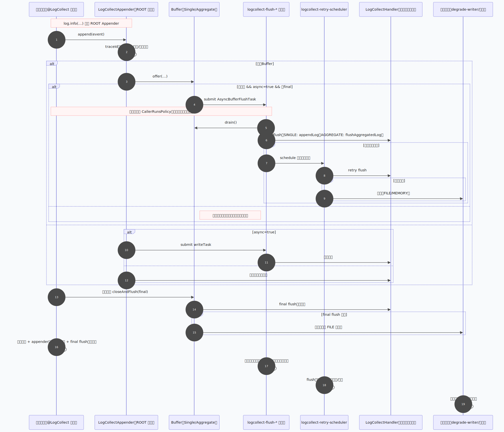

# @LogCollect

<p align="center">
  <strong>轻量级业务日志聚合框架</strong>
</p>

<p align="center">
  一个注解，将方法及其全部异步子线程的日志精准聚合到业务数据库——与全局日志天然隔离。
</p>

<p align="center">
  
  
  
  
</p>

---

## 目录

**概述与快速上手**

- [简介](#简介)
- [核心特性](#核心特性)
- [版本兼容矩阵](#版本兼容矩阵)
- [快速开始](#快速开始)

**Part I · 架构设计与核心实现**

- [1 处理流水线与数据流](#1-处理流水线与数据流)
- [2 上下文模型与传播机制](#2-上下文模型与传播机制)
- [3 双模式收集引擎](#3-双模式收集引擎)
- [4 Handler 接口参考](#4-handler-接口参考)
- [5 注解配置参考](#5-注解配置参考)
- [6 全异步场景覆盖](#6-全异步场景覆盖)

**Part II · 质量门禁与性能工程**

- [7 安全防护体系](#7-安全防护体系)
- [8 熔断降级机制](#8-熔断降级机制)
- [9 配置中心集成](#9-配置中心集成)
- [10 可观测性](#10-可观测性)
- [11 Actuator 管理端点](#11-actuator-管理端点)
- [12 性能工程](#12-性能工程)

**运维与参考**

- [13 生产部署指南](#13-生产部署指南)
- [JVM 调优指南](docs/jvm-tuning-guide.md)
- [14 常见问题](#14-常见问题)
- [15 开发注意事项](#15-开发注意事项)

**附录**

- [A 框架定位与生态关系](#a-框架定位与生态关系)
- [B 已知局限性](#b-已知局限性)
- [C 项目结构](#c-项目结构)
- [D 贡献指南](#d-贡献指南)
- [E 代码规模统计](#e-代码规模统计)

---

## 简介

### 这是什么

`@LogCollect` 是一个轻量级业务日志聚合框架。在方法上加一个注解，即可将该方法及其启动的**全部异步子线程**的日志精准聚合到业务数据库，与全局日志天然隔离。

### 解决什么问题

| 场景 | 传统痛点 | @LogCollect 方案 |
|------|---------|------------------|
| 每日对账定时任务 | 50 个子线程日志散落在文件中，按 traceId 手动 grep | 自动聚合到 `reconcile_log` 表的一条记录，一次查询回溯全过程 |
| 支付接口审计 | 操作日志需与支付流水强绑定，文件日志无法做到 | 日志直接写入业务表，与支付记录关联查询 |
| 数据导入任务 | 并行导入 10 万条数据，需逐条追踪成败 | 每条导入日志按任务聚合，失败逐条追溯 |

### 一句话定位

> **业务日志聚合的最后一公里** —— 与 ELK / SkyWalking 互补，而非替代。

---

## 核心特性

```
┌─────────────────────────────────────────────────────────────────────┐
│                        @LogCollect 核心特性                          │
│                                                                     │
│  🎯 精准聚合     仅捕获指定方法（含全部异步子线程）的日志              │
│  ⚡ 极致性能     异步非阻塞 + 预分配环形缓冲 + 单写者刷写             │
│  🔄 双收集模式   单条入库 / 聚合刷写，注解一键切换                    │
│  🔗 上下文贯穿   LogCollectContext 跨 before → 收集 → after 全生命周期│
│  🔒 纵深安全     9 层防御：注入过滤 / 脱敏 / 防 SQL 注入 / 防泄漏    │
│  🛡️ 极端高可用   4 层降级 + 三状态熔断 + 指数退避 + 渐进恢复         │
│  🔌 双框架适配   Logback / Log4j2 自动识别，零配置切换               │
│  🧵 全异步覆盖   @Async / 线程池 / WebFlux / new Thread 全支持       │
│  ☁️ 配置热更     Nacos / Apollo / Spring Cloud Config 动态调整       │
│  📊 可观测性     Micrometer Metrics + 健康检查 + Actuator 端点        │
│  📦 极简接入     一个注解 + 实现一个方法，两步完成                    │
└─────────────────────────────────────────────────────────────────────┘
```

---

## 版本兼容矩阵

| 依赖 | 最低版本 | 推荐版本 | 说明 |
|------|---------|---------|------|
| **JDK** | 1.8+ | 11+ / 17+ | 全版本编译测试通过 |
| **Spring Boot** | 2.7.x | 2.7.x / 3.x | 双版本自动适配 |
| **Context Propagation** | 1.0.6 | 1.0.6 (JDK 8) / 1.1.1 (JDK 11+) | BOM 按 JDK Profile 自动分流 |
| **Micrometer** | 1.10.13 | 1.10.x / 1.12.x | 可选，Metrics 依赖 |
| **Reactor** | 3.4.x（可选） | 3.5.3+（自动传播） | WebFlux 场景需要 |

**Spring Boot 2.7 与 3.x 的差异**

| 能力 | Boot 2.7.x | Boot 3.x |
|------|-----------|----------|
| @Async 传播 | 默认 `AsyncConfigurer` 自动补齐 | 原生 Context Propagation |
| Spring 线程池传播 | `BeanPostProcessor` 自动包装 | 原生 Context Propagation |
| WebFlux 传播 | Reactor 3.5.3+：自动；3.4.x：框架 Hook | 原生自动传播 |
| 自动装配注册 | `META-INF/spring.factories` | `META-INF/spring/...AutoConfiguration.imports` |

> 两种版本下业务代码完全一致，框架启动时自动检测并适配，对用户透明。

---

## 快速开始

### 引入依赖

```xml
<dependencyManagement>
    <dependencies>
        <dependency>
            <groupId>io.github.mora-na</groupId>
            <artifactId>logcollect-bom</artifactId>
            <version>2.2.3</version>
            <type>pom</type>
            <scope>import</scope>
        </dependency>
    </dependencies>
</dependencyManagement>

<dependencies>
    <!-- 核心 Starter（必须） -->
    <dependency>
        <groupId>io.github.mora-na</groupId>
        <artifactId>logcollect-spring-boot-starter</artifactId>
    </dependency>

    <!-- Nacos 配置中心适配（可选） -->
    <dependency>
        <groupId>io.github.mora-na</groupId>
        <artifactId>logcollect-config-nacos</artifactId>
    </dependency>

    <!-- 项目使用 Log4j2 时额外引入（可选） -->
    <dependency>
        <groupId>io.github.mora-na</groupId>
        <artifactId>logcollect-log4j2-adapter</artifactId>
    </dependency>
</dependencies>
```

### 实现 Handler（聚合模式，推荐）

```java
@Component
@RequiredArgsConstructor
public class TaskLogHandler implements LogCollectHandler {

    private final TaskLogService taskLogService;

    @Override
    public CollectMode preferredMode() {
        return CollectMode.AGGREGATE;
    }

    @Override
    public void before(LogCollectContext context) {
        Long executionLogId = taskLogService.createStartLog(
                context.getTraceId(),
                context.getMethodSignature(),
                context.getStartTime());
        context.setBusinessId(executionLogId);
        context.setAttribute("operator", "system");
    }

    @Override
    public void flushAggregatedLog(LogCollectContext context, AggregatedLog aggregatedLog) {
        Long executionLogId = context.getBusinessId(Long.class);
        taskLogService.appendAggregatedLog(
                executionLogId,
                aggregatedLog.getContent(),
                aggregatedLog.getEntryCount(),
                aggregatedLog.getMaxLevel(),
                aggregatedLog.isFinalFlush());
    }

    @Override
    public void after(LogCollectContext context) {
        Long executionLogId = context.getBusinessId(Long.class);
        taskLogService.finish(
                executionLogId,
                context.hasError(),
                context.getElapsedMillis(),
                context.getTotalCollectedCount(),
                context.getTotalDiscardedCount(),
                context.getFlushCount(),
                context.hasError() ? context.getError().getMessage() : null);
    }
}
```

> 推荐继承 `AbstractJdbcLogCollectHandler` 安全基类，自动使用参数化查询防止 SQL 注入。详见 [7 安全防护体系](#7-安全防护体系)。

### 加注解

```java
@Service
public class ReconcileService {

    @LogCollect
    public void dailyReconcile() {
        log.info("开始对账，用户手机: 13812345678");
        // → 自动脱敏为: 开始对账，用户手机: 138****5678

        CompletableFuture.runAsync(() -> {
            log.info("子线程处理中...");
            // → 自动聚合到同一 traceId
        }, springManagedExecutor);

        log.info("对账完成");
    }
}
```

**完成。** 引入 Starter 后，日志采集 Appender 自动注册，异步收集、缓冲聚合、日志净化、敏感脱敏、降级兜底、Metrics 上报全部自动开启。

---

<h2 align="center">Part I · 架构设计与核心实现</h2>

<p align="center"><em>框架的第一阶段聚焦于核心抽象的设计与实现：处理流水线、上下文模型、双模式收集引擎、Handler 契约、注解配置面以及全异步场景覆盖。</em></p>

---

## 1 处理流水线与数据流

### 1.1 端到端处理流程

```
业务方法调用
    ↓
┌──────────────────────────────────────────────────────────────┐
│ 0. 配置解析                                                   │
│    四级合并：框架默认 ← 注解 ← 配置中心全局 ← 配置中心方法级    │
├──────────────────────────────────────────────────────────────┤
│ 1. AOP 前置                                                   │
│    生成 UUID traceId → 创建 LogCollectContext                 │
│    → 栈式上下文 push → handler.before(context)                │
├──────────────────────────────────────────────────────────────┤
│ 2. 业务方法执行                                                │
│    每条日志 → Appender 拦截 → 检查 MDC traceId                │
│    ↓ 匹配                                                     │
│ 3. Appender 热路径（零分配主路径）                              │
│    级别/Logger 过滤 → RingBuffer tryClaim                      │
│    → 槽位 populate → publish                                   │
│    （缓冲区满：WARN/ERROR 进入 overflow，低等级按策略丢弃）      │
│    ↓                                                          │
│ 4. Consumer 重逻辑                                              │
│    shouldCollect() → SecurityPipeline(sanitize + mask + timeout)│
│    ↓                                                          │
│ 5. 模式分发                                                    │
│    ├─ SINGLE:    LogEntry → SingleWriterBuffer                 │
│    └─ AGGREGATE: formatRawTo → AggregateDirectBuffer           │
│    ↓                                                          │
│ 6. flush / 持久化                                               │
│    ├─ SINGLE:    循环 handler.appendLog(ctx, entry)            │
│    └─ AGGREGATE: handler.flushAggregatedLog(ctx, agg)          │
│    ↓ 失败                                                     │
│ 7. 熔断与降级                                                   │
│    CLOSED → OPEN → HALF_OPEN + FILE/MEMORY/策略降级            │
├──────────────────────────────────────────────────────────────┤
│ 8. AOP 后置（finally）                                         │
│    markClosing → Consumer drain 到 producerCursor             │
│    → final flush → handler.after(context) → 栈式上下文 pop     │
└──────────────────────────────────────────────────────────────┘
```

### 1.2 数据流

```
           ILoggingEvent (Logback) / LogEvent (Log4j2)
                            │
            ┌───────────────┴────────────────┐
            │      Appender 层（适配器）       │
            │  过滤 + 字段提取 + RingBuffer写入 │
            │  ★ tryClaim/getSlot/publish      │
            │  ★ 满载时分级背压                │
            └───────────────┬────────────────┘
                            │ MutableRawLogRecord slot
            ┌───────────────┴────────────────┐
            │     Consumer（Core 层）           │
            │  ① shouldCollect                 │
            │  ① FastPathDetector 位掩码预扫描 │
            │  ② sanitize(content)            │
            │  ③ sanitizeThrowable()          │
            │  ④ mask(content/throwable)      │
            │  ⑤ → MutableProcessedLogRecord  │
            └───────────────┬────────────────┘
                            │
               ┌────────────┴───────────────┐
               │                            │
       ┌───────┴────────┐         ┌─────────┴──────────┐
       │  SINGLE 缓冲区  │         │  AGGREGATE 直聚合    │
       │ SingleWriterBuffer│       │ AggregateDirectBuffer│
       └───────┬─────────┘         └─────────┬──────────┘
               │ flush                       │ flush
               ↓                             ↓
   handler.appendLog(ctx, entry)   buildAndReset → AggregatedLog
   逐条结构化存储                   handler.flushAggregatedLog(ctx, agg)
```

#### 1.2.1 运行时序（线程与缓冲协作）

GitHub README 中 `sequenceDiagram` 可能无法稳定渲染，时序源码已独立放到文件中：

- Mermaid 源文件：`docs/diagrams/LogCollectSequenceDiagram.mmd`
- SVG 文件：`docs/diagrams/LogCollectSequenceDiagram.svg`



### 1.3 日志框架自动接入

框架启动时自动将采集 Appender 注册到 ROOT Logger，实现零配置接入：

- **Logback**：`LogCollectLogbackAppender`
- **Log4j2**：`LogCollectLog4j2Appender`

```yaml
logcollect:
  logging:
    auto-register-appender: true   # 默认开启，无需手工改 logback-spring.xml
    appender-name: LOG_COLLECT
```

启动时框架会检查 ROOT 上的同步 I/O Appender（如未异步包装的 `ConsoleAppender` / `FileAppender`），并输出性能告警。控制台 pattern 通过 `ConsolePatternDetector` SPI 自动探测，经 `PatternCleaner + PatternValidator` 清理校验后写入 `LogLineDefaults`。

### 1.4 V2.1 双阶段流水线升级（退化修复版）

#### 1.4.1 原设计缺陷（V2 基线）

- **GC 全面退化**：V2 生产者与消费者热路径存在逐事件对象分配（`RawLogRecord`、队列节点、中间处理对象），跨线程生命周期拉长后放大 Young/Old GC 压力。
- **e2e 多线程扩展比下降**：1 线程收益明显，但 8 线程受 Appender 锁竞争和队列竞争限制，`8t/1t` 比值回落。
- **关闭协议复杂**：关闭窗口依赖回投和线程接管，边界判定复杂、维护成本高。
- **AGGREGATE 中间对象冗余**：`ProcessedLogRecord -> LogEntry -> LogSegment -> StringBuilder` 链路过长，存在可消除分配。

#### 1.4.2 最优设计落地（V2.1）

| 优化项 | 升级方案 | 代码落地 | 优化效果 |
|------|---------|---------|---------|
| S1 | MPSC 预分配环形缓冲区替代链式队列 | `PipelineRingBuffer` + `MutableRawLogRecord` + Appender `tryClaim/getSlot/publish` | 生产者热路径零分配；队列节点分配消除 |
| S2 | Consumer 中间对象复用 | `MutableProcessedLogRecord` + `SecurityPipeline.processRawInto(...)` | 消费者不再逐事件 new `ProcessedLogRecord` |
| S3 | AGGREGATE 直格式化 | `AggregateDirectBuffer` + `LogLinePatternParser.formatRawTo(...)` | 绕过 `LogEntry/LogSegment`，复用 `StringBuilder` |
| S4 | Appender 去同步化 | Logback 适配器使用 `UnsynchronizedAppenderBase`（并保留线程安全数据结构） | 消除框架自身 `doAppend` 锁争用 |
| S5 | SINGLE 单写者缓冲预分配 | `SingleWriterBuffer` 构造时按 `maxBufferSize` 预分配 | 消除 `ArrayList` 运行期扩容与拷贝 |
| S6 | 全局内存记账批量化 | `BatchedMemoryAccountant`（阈值同步到 `GlobalBufferMemoryManager`） | 降低多 Consumer 下 CAS 频率与缓存争用 |
| S7 | JVM 调优指导 | 新增 `docs/jvm-tuning-guide.md` | JDK17 场景可按建议参数进一步降低 GC 抖动 |

#### 1.4.3 关键设计变更（与旧设计缺陷一一对应）

| 原设计缺陷 | V2.1 方案 | 解决结果 |
|-----------|-----------|---------|
| 生产者逐事件 `new RawLogRecord + QueueNode` | 预分配 `PipelineRingBuffer` 槽位 + 序列发布 | 正常路径零分配，GC 源头下移 |
| 消费者逐事件中间对象链路长 | `MutableProcessedLogRecord` 复用 + AGGREGATE 直写 | 消费者中间对象显著减少 |
| AGGREGATE 依赖 `LogSegment` 队列 | `AggregateDirectBuffer` 直接聚合 | flush 前仅维护复用 `StringBuilder` |
| Appender 锁竞争 | 无锁 Appender + CAS RingBuffer | 多线程写入抖动降低 |
| 关闭阶段接管复杂 | `producerCursor/consumerCursor` 精确 drain + unpublished timeout | 关闭边界可判定、协议更简洁 |
| 全局内存频繁 CAS | 本地批量记账后同步 | 降低高并发下全局计数争用 |

#### 1.4.4 配置升级与兼容策略

- 新增全局参数：`pipeline.ring-buffer-capacity`、`pipeline.overflow-queue-capacity`、`pipeline.unpublished-slot-timeout-ms`、`pipeline.consumer-idle-strategy`、`buffer.memory-sync-threshold-bytes`。
  说明：`pipeline.consumer-idle-strategy` 在 V2.2 起已废弃，改为自适应 idle（spin/yield/park）自动策略。
- 注解新增：`@LogCollect(pipelineRingBufferCapacity=...)`。
- 兼容保留：`pipeline.queue-capacity` 与 `@LogCollect(pipelineQueueCapacity)` 仍可用，但会映射到 ring 参数并输出迁移告警。
- 热更新语义：`ring-buffer-capacity` 变更需要重建上下文（运行期变更会提示需重启生效）；其余新增参数按原有动态配置语义执行。

#### 1.4.5 回归检查清单（方案逐条核对）

- [x] S1：RingBuffer 主路径已接入 Logback/Log4j2 Appender，`PipelineQueue` 仅保留兼容。
- [x] S2：Consumer 使用 `MutableProcessedLogRecord` 复用对象，安全流水线写入复用对象。
- [x] S3：AGGREGATE 模式启用 `AggregateDirectBuffer` + `formatRawTo` 直写格式化。
- [x] S4：Logback Appender 为无锁基类；并发路径仅使用线程安全结构（CAS/CLQ/LongAdder）。
- [x] S5：`SingleWriterBuffer` 预分配容量，flush 后复用内部数组。
- [x] S6：`BatchedMemoryAccountant` 已集成 Consumer，本地阈值同步到全局内存管理器。
- [x] S7：新增 JVM 调优文档并在 README 引用。
- [x] 关闭协议：`closeContext -> drainAndClose` 基于游标精确排空，支持未发布槽位超时跳过并记录指标。
- [x] 配置迁移：旧 `queue-capacity` 自动映射新 key，注解旧参数同样映射。
- [x] 回归验证：`mvn -q -Djacoco.skip=true test` 全仓通过。

### 1.5 V2.2 全流程无锁升级（S1-S9）

#### 1.5.1 原设计缺陷（V2.1 残余）

| 缺陷 | 影响路径 | 现象 |
|------|---------|------|
| `before/after` 超时保护依赖调度器 | 逐调用路径 | 每次调用产生 `schedule + cancel` 锁竞争，P99 尾延迟抖动 |
| Consumer 线性扫描上下文 | Consumer 路径 | 并发上下文多时出现大量空轮询，扩展性退化 |
| `onSpinWait` 反射调用 | 空闲路径 | 空转分支存在可避免的反射开销 |
| Log4j2 全量 MDC 复制 + `intern` | 逐事件热路径 | 产生额外分配与 StringTable 竞争 |
| 熔断器窗口遍历与同步路径 | 失败恢复路径 | 失败密集场景存在锁与 O(N) 扫描 |
| AsyncFlushExecutor 基于阻塞队列 | 兼容路径 | flush 提交/获取依赖锁 |
| 重试退避阻塞调用线程 | flush 失败路径 | Consumer/业务线程可被退避冻结 |
| Metrics 重复注册检查 | 逐调用路径 | 重复 map 查找 |
| `PipelineQueue` 仍可被误用 | 兼容路径 | 旧队列 API 误接入风险 |

#### 1.5.2 升级方案与代码落地（严格对照 S1-S9）

| 方案 | 最优设计 | 代码落地 | 优化效果 |
|------|---------|---------|---------|
| S1 | `deadline + watchdog` 替代 `ScheduledExecutorService` 超时调度 | `HandlerTimeoutGuard` + `LogCollectAspect.safeInvoke/resolveTimeoutGuard` | 正常路径不再执行调度/取消；保留中断超时语义 |
| S2 | Consumer 事件驱动 + Lazy Signal（去分配唤醒） | `PipelineRingBuffer.signalIfWaiting`、`PipelineConsumer.signalIfWaiting/idlePark/processAssignedContexts`、`AdaptiveIdleStrategy.idle(..., parkCallback)`、Appender 热路径改为 `publish + signalIfWaiting` | 生产者热路径去掉逐事件 `CLQ.offer + unpark`，常规路径仅 1 次 volatile 读；唤醒无堆分配 |
| S3 | `MethodHandle` 缓存 `onSpinWait` | `SpinWaitHint` + `PipelineConsumer.onSpinWaitCompat` | 去除反射热开销，JDK8 自动回退 no-op |
| S4 | Log4j2 定向提取字段、按需 MDC、线程名缓存替代 `intern` | `LogCollectLog4j2Appender.extractTraceId/extractRelevantMdc/cachedThreadName` + `LogCollectLog4j2AppenderAutoConfiguration` 注入 `log4j2.mdc-keys` | Log4j2 热路径消除全量 MDC 复制与 `intern` 竞争 |
| S5 | 熔断器改为 CAS + 衰减计数器 | `LogCollectCircuitBreaker`（`maybeDecay`、原子计数、CAS 状态流转） | 去除 synchronized + 窗口遍历，失败率判定 O(1) |
| S6 | AsyncFlushExecutor 无锁队列化 | `AsyncFlushExecutor`（`ConcurrentLinkedQueue + queueSize + LockSupport`） | 兼容路径 flush 提交/消费去锁化 |
| S7 | 常规 flush 非阻塞重试；同步 flush 退避上限可配 | `ResilientFlusher.flushBatch`（sync/async 双分支）+ `flush.retry-sync-cap-ms` | Consumer 常规路径不被失败重试长期阻塞 |
| S8 | Metrics 注册去重 | `LogCollectAspect.registeredBreakerGauges` | 每个 methodKey 仅首次注册 gauge |
| S9 | 清理旧队列入口 | `PipelineQueue`（`@Deprecated(forRemoval=true)` + 构造/方法抛 `UnsupportedOperationException`） | 阻断旧 ABQ 误用，统一 RingBuffer 路径 |

#### 1.5.3 配置变更（V2.2 / V2.2.1）

- 新增：`handler.watchdog-interval-ms`、`handler.watchdog-slots`、`pipeline.consumer-drain-batch`、`pipeline.consumer-spin-threshold`、`pipeline.consumer-yield-threshold`、`pipeline.consumer-cursor-advance-interval`、`degrade.decay-interval-seconds`、`flush.retry-sync-cap-ms`、`log4j2.mdc-keys`。
- 废弃：`pipeline.consumer-idle-strategy`（V2.2 起固定使用自适应空闲策略；配置后 WARN 并忽略）。
- 语义不变：`handler-timeout-ms`、`degrade.window-size`、`degrade.failure-rate-threshold`、`buffer.*`、`security.*`。

#### 1.5.4 回归检查（方案逐条落实）

- [x] S1：`HandlerTimeoutGuard` 已替代调度器超时保护，`LogCollectAspect` 接入并支持 watchdog 参数热生效重建。
- [x] S2：Consumer 已切换为 Lazy Signal 事件驱动（consumer 级 waiting 标记 + park 前双检 + 惰性 unpark）。
- [x] S3：`SpinWaitHint` 已在 Consumer 自旋点替换反射调用。
- [x] S4：Log4j2 已改为 `ReadOnlyStringMap.getValue` 定向提取 + 线程名缓存；`log4j2.mdc-keys` 已接入自动配置。
- [x] S5：熔断器已改为原子计数 + 衰减模型 + CAS 状态机。
- [x] S6：`AsyncFlushExecutor` 已替换为无锁 MPSC 任务队列实现。
- [x] S7：`ResilientFlusher` 已支持异步重试与同步退避上限（默认 200ms）。
- [x] S8：Metrics breaker gauge 已做 methodKey 级幂等注册。
- [x] S9：`PipelineQueue` 已空壳化并阻止运行时使用。
- [x] 回归结果：`mvn -pl logcollect-logback-adapter,logcollect-log4j2-adapter,logcollect-spring-boot-autoconfigure -am test -DskipITs` 全通过（`core/logback/log4j2/autoconfigure`）。
- [x] 偏差修正：无未落地点；S1-S9 与代码实现一致。

#### 1.5.5 V2.2.1 并发扩展比修复（F1-F6）

**原设计缺陷（V2.2 S2 首版实现）**

- 生产者 `publish` 后逐事件触发 `signalConsumer`，热路径包含 `CLQ.offer + unpark`，在 8t 场景抹平 JDK11/17/21 的 CAS 扩展优势。
- `ConsumerReadyQueue` 逐事件节点分配导致额外 GC 与 CAS 竞争。
- `consumerCursor` 批末一次性推进，短窗口内放大生产者“队列满”误判概率。

**修复方案（已落地）**

- F1：Appender 热路径从 `publish + signalConsumer(context)` 重构为 `publish + ringBuffer.signalIfWaiting()`。
- F2：移除 `ConsumerReadyQueue`；`LogCollectContext.markPipelineReady/clearPipelineReady` 废弃并保留 no-op 以保证二进制兼容；唤醒改为 consumer 级 `waiting` 原子标记。
- F3：`PipelineConsumer.processContextBatch` 改为分段推进 `consumerCursor`（默认间隔 8，可配置）。
- F4：`benchmark-baseline.json` 增加 CI 基线版本元信息（`frameworkVersion/commitHash/refreshDate/runs/buildStrategy`）。
- F5：`StressCIGateTest` ratio 阈值改为分层 multiplier（高 ratio 放宽、低 ratio 收紧）。
- F6：ratio 未达标时引入分子吞吐绝对值兜底，满足吞吐 floor 时降级为 WARNING，避免 ratio 单点误报。

**优化效果**

- 生产者常规路径恢复为 `1 CAS + 1 volatile 写 + 1 volatile 读`（无额外分配）。
- Consumer 保持事件驱动响应性，同时避免逐事件唤醒开销。
- Gate 规则更稳健：真实退化仍 FAIL，统计伪像降级 WARNING。

---

## 2 上下文模型与传播机制

### 2.1 LogCollectContext

`LogCollectContext` 是贯穿日志收集全生命周期的上下文对象，在 `before()` → 日志收集 → `after()` 各阶段共享同一实例。

```
LogCollectContext
├── 不可变字段（框架创建时设置，final）
│   ├── traceId            唯一追踪 ID（UUID）
│   ├── methodSignature    方法全限定签名
│   ├── className / methodName / methodArgs
│   ├── startTime / startTimeMillis
│   ├── collectMode        SINGLE / AGGREGATE
│   └── handlerClass       Handler 的 Class 类型
│
├── 执行状态（AOP finally 中设置，volatile）
│   ├── returnValue        方法返回值
│   └── error              方法抛出的异常
│
├── 收集统计（框架维护，AtomicInteger/AtomicLong，只读）
│   ├── totalCollectedCount / totalDiscardedCount
│   ├── totalCollectedBytes
│   └── flushCount
│
└── 用户自定义状态
    ├── businessId         业务唯一标识（volatile）
    └── attributes         ConcurrentHashMap，支持跨阶段传递任意数据
```

**便捷方法**

| 方法 | 说明 |
|------|------|
| `hasError()` | 方法是否异常结束 |
| `getElapsedMillis()` | 方法已执行的毫秒数 |
| `getBusinessId(Class<T>)` | 类型安全地获取 businessId |
| `setAttribute(key, value)` / `getAttribute(key, Class<T>)` | 跨阶段读写自定义属性 |

### 2.2 上下文传播模型

```
主线程
│  @LogCollect 方法入口
│  ├── push(LogCollectContext) → ThreadLocal + MDC
│  │
│  ├── log.info("主线程日志")  ────────────────────── ✅ 自动拦截
│  ├── @Async 子线程  ─── TaskDecorator 自动传播 ──── ✅ 自动拦截
│  ├── CompletableFuture + Spring 池  ──────────────── ✅ 自动拦截
│  ├── WebFlux Mono/Flux  ── Reactor Hook ──────────── ✅ 自动拦截
│  ├── new Thread(wrapRunnable(...))  ── 手动一行 ──── ✅ 手动包装
│  ├── 嵌套 @LogCollect ── push/pop ──────────────── ✅ 栈式隔离
│  │
│  └── finally: pop(ctx) → 栈空 → ThreadLocal.remove()
```

### 2.3 四级配置优先级

```
优先级从高到低（每个参数独立合并，高优先级仅覆盖其显式设置的参数）：

① 配置中心 · 方法级   logcollect.methods.{类名_方法名}.level=ERROR
   ↓
② 配置中心 · 全局     logcollect.global.level=WARN
   ↓
③ @LogCollect 注解     @LogCollect(minLevel = "INFO")
   ↓
④ 框架默认值           INFO
```

Handler 解析结果按 `Method` 缓存；配置中心刷新后缓存自动失效，下次调用按最新配置解析。

### 2.4 静态访问器

业务代码可在任意层级直接读写当前收集上下文（类似 `MDC` / `SecurityContextHolder`）：

```java
@Service
public class ImportService {

    @LogCollect
    public void importData(String taskId, List<DataRecord> records) {
        LogCollectContext.setCurrentBusinessId(taskId);
        LogCollectContext.setCurrentAttribute("totalRecords", records.size());

        for (DataRecord record : records) {
            processRecord(record);  // 无需层层传参
        }
    }

    private void processRecord(DataRecord record) {
        String taskId = LogCollectContext.getCurrentBusinessId(String.class);
        Integer total = LogCollectContext.getCurrentAttribute("totalRecords", Integer.class);
        log.info("[{}] processing record={} / total={}", taskId, record.getId(), total);
    }
}
```

| 方法 | 返回值 | 非收集范围内行为 |
|------|--------|-----------------|
| `current()` | `LogCollectContext` / `null` | `null` |
| `isActive()` | `boolean` | `false` |
| `getCurrentTraceId()` | `String` / `null` | `null` |
| `setCurrentBusinessId(Object)` | `void` | 静默忽略 |
| `getCurrentBusinessId(Class<T>)` | `T` / `null` | `null` |
| `setCurrentAttribute(String, Object)` | `void` | 静默忽略 |
| `getCurrentAttribute(String, Class<T>)` | `T` / `null` | `null` |
| `getCurrentCollectedCount()` | `int` | `0` |

> 非 `@LogCollect` 范围内调用完全安全：读操作返回零值/null，写操作静默忽略，不抛异常。属性容器使用 `ConcurrentHashMap`，并发读写安全。嵌套场景按栈顶上下文生效，生命周期结束后出栈并清理 `ThreadLocal`。

---

## 3 双模式收集引擎

框架提供两种日志收集模式，由注解 `collectMode` 参数决定，默认使用效率更高的聚合模式。

### 3.1 模式总览

```
┌─────────────────────────────────────────────────────────────────────────┐
│  SINGLE（单条缓冲模式）                                                  │
│  ┌──────┐  ┌──────┐  ┌──────┐        ┌─────────────────────────┐       │
│  │Log 1 │→ │Log 2 │→ │Log N │ ────→  │ 批量循环调用 appendLog  │       │
│  └──────┘  └──────┘  └──────┘        └─────────────────────────┘       │
│   Consumer 串行写入 SingleWriterBuffer(ArrayList 预分配)                │
│   达到阈值 / 方法结束 → flush  每次 flush 产生 N 次 handler 调用         │
│                                                                         │
│  AGGREGATE（聚合刷写模式）⭐ 默认                                        │
│  ┌──────┐  ┌──────┐  ┌──────┐        ┌──────────────────────────────┐  │
│  │Log 1 │→ │Log 2 │→ │Log N │ ────→  │ 一次调用 flushAggregatedLog │  │
│  └──────┘  └──────┘  └──────┘        └──────────────────────────────┘  │
│   Consumer 直格式化到 AggregateDirectBuffer(StringBuilder 复用)         │
│   达到阈值 / 方法结束 → flush  每批一次构建 AggregatedLog 并刷写        │
└─────────────────────────────────────────────────────────────────────────┘
```

### 3.2 模式对比

| 维度 | SINGLE | AGGREGATE（默认） |
|------|--------|------------------|
| Handler 调用 | N 次 `appendLog()` | 1~几次 `flushAggregatedLog()` |
| 典型 DB 操作 | N 次 INSERT | 1 次 INSERT / UPDATE |
| 对象开销 | 主要为 `LogEntry`（逐条不可避免） | 中间对象复用，flush 时批量分配 |
| GC 压力 | 中等（按条创建 `LogEntry`） | 低（直写聚合缓冲，批量 `toString`） |
| 适用场景 | 逐条入明细表、失败批次重试 | 大批量日志聚合到单条记录 |

> AGGREGATE 在对象开销、调用次数、DB 写入次数上全面优于 SINGLE，因此设为默认。

### 3.3 使用方式

**聚合模式（默认，推荐）**

```java
@LogCollect  // 默认即为聚合模式
public void dailyReconcile() { ... }
```

```java
@Component
public class ReconcileLogHandler implements LogCollectHandler {

    @Autowired
    private ReconcileLogMapper mapper;

    @Override
    public void before(LogCollectContext context) {
        ReconcileLog log = new ReconcileLog();
        log.setTraceId(context.getTraceId());
        log.setTaskName(context.getMethodName());
        log.setStatus("RUNNING");
        log.setStartTime(context.getStartTime());
        log.setLogContent("");
        mapper.insert(log);
        context.setBusinessId(log.getId());
    }

    @Override
    public void flushAggregatedLog(LogCollectContext context,
                                   AggregatedLog aggregatedLog) {
        Long logId = context.getBusinessId(Long.class);
        mapper.appendContent(logId, aggregatedLog.getContent());
        if ("ERROR".equals(aggregatedLog.getMaxLevel())) {
            mapper.markHasError(logId);
        }
    }

    @Override
    public void after(LogCollectContext context) {
        Long logId = context.getBusinessId(Long.class);
        ReconcileLog log = new ReconcileLog();
        log.setId(logId);
        log.setStatus(context.hasError() ? "FAILED" : "SUCCESS");
        log.setEndTime(LocalDateTime.now());
        log.setElapsedMs(context.getElapsedMillis());
        log.setCollectedCount(context.getTotalCollectedCount());
        log.setFlushCount(context.getFlushCount());
        log.setErrorMsg(context.hasError() ? context.getError().getMessage() : null);
        mapper.updateById(log);
    }
}
```

**单条模式（需逐条入明细表时）**

```java
@LogCollect(collectMode = CollectMode.SINGLE, maxBufferSize = 50)
public void importData(List<DataRecord> records) { ... }
```

```java
@Component
public class ImportLogHandler implements LogCollectHandler {

    @Autowired
    private ImportLogDetailMapper detailMapper;

    @Override
    public CollectMode preferredMode() {
        return CollectMode.SINGLE;
    }

    @Override
    public void appendLog(LogCollectContext context, LogEntry entry) {
        ImportLogDetail detail = new ImportLogDetail();
        detail.setLogId(context.getBusinessId(Long.class));
        detail.setContent(entry.getContent());     // 已过净化 + 脱敏
        detail.setLevel(entry.getLevel());
        detail.setLogTime(entry.getTime());
        detail.setThreadName(entry.getThreadName());
        detailMapper.insert(detail);
    }
}
```

### 3.4 模式选择逻辑

当注解 `collectMode = AUTO`（默认）时：

```
@LogCollect(collectMode = AUTO)
         │
         ▼
handler.preferredMode() 返回值?
  ├── SINGLE    → 模式1
  ├── AGGREGATE → 模式2
  └── AUTO      → 模式2（框架默认）
```

优先级：**注解显式指定 > Handler.preferredMode() > 框架默认 (AGGREGATE)**

### 3.5 缓冲区设计

#### 3.5.1 Pipeline 主路径（默认）

- Appender 线程只做字段提取并写入 `PipelineRingBuffer` 预分配槽位（MPSC）。
- Consumer 线程串行处理，避免多线程并发写缓冲：
  - `SINGLE`：写入 `SingleWriterBuffer`（`ArrayList` 预分配，按阈值批量 `appendLog`）。
  - `AGGREGATE`：写入 `AggregateDirectBuffer`（复用 `StringBuilder`，直接格式化，按阈值批量 `flushAggregatedLog`）。
- Pattern 热更：Consumer 检测 `logLinePattern` 版本变化，先 flush 旧版本批次再切换新版本。
- 失败处理：统一走 `ResilientFlusher` 重试与降级兜底。

#### 3.5.2 Legacy 兼容路径（仅 pipeline 关闭时）

- 保留 `SingleModeBuffer` / `AggregateModeBuffer` 作为兼容实现。
- `PipelineQueue` 在 V2.2 已降级为空壳兼容类（`@Deprecated(forRemoval=true)`），构造即抛 `UnsupportedOperationException`，防止误用旧队列实现。

> V2.1 的关键变化是将 “多线程并发聚合” 收敛为 “Appender 并发写 RingBuffer + Consumer 单线程聚合”，因此可以安全使用复用型 `StringBuilder`，并消除大量中间对象。

### 3.6 内存安全防护（v1.2.0）

升级后两种模式共享六层防护：

```
第一层：级别/Logger 前置过滤       低于配置级别直接不收集，零内存占用
第二层：shouldCollect() 过滤        用户自定义业务过滤
第三层：缓冲区阈值（per-method）     count / bytes 达阈值触发 flush
第四层：全局内存软限（cross-method）  tryAllocate() 失败 → 走降级通道
第五层：全局内存硬顶（cross-method）  forceAllocate() 到顶 → 高等级也走降级
第六层：缓冲区关闭保护              方法结束后 closed=true，拒绝迟到日志
```

> 注意：`v1.2.0` 起移除框架内内容截断。日志内容全量传递，超大条目改为 `Direct Flush → 失败降级`，不再因超长而静默丢弃。

**全局内存管控配置**

| 参数 | 默认值 | 动态可更新 | 说明 |
|------|--------|-----------|------|
| `total-max-bytes` | `100MB` | ✅ | 软限：所有活跃方法共享的全局内存配额 |
| `hard-ceiling-bytes` | `soft × 1.5` | ✅ | 硬顶：`forceAllocate` 的绝对上限；未配置时自动按 `total-max-bytes × 1.5` 推导 |
| `counter-mode` | `EXACT_CAS` | ❌ 需重启 | 全局计数策略，运行时仅启用一种 |
| `estimation-factor` | `1.0` | ✅ | 内存估算补偿系数，固定开销已内含，通常无需调整 |

**counter-mode 选项（运行时二选一）**

| 模式 | 实现 | 精度 | 适用场景 |
|------|------|------|---------|
| `EXACT_CAS` | `AtomicLong` CAS 循环 | 精确 | 默认推荐 |
| `STRIPED_LONG_ADDER` | `LongAdder` 分段累加 | 最终一致（`sum()` 弱一致读） | 超高并发场景 |

#### 3.6.1 升级缺陷修复清单（原设计 → 新设计）

| 原设计缺陷 | 升级后实现 | 优化效果 |
|-----------|-----------|---------|
| 单条日志超过 `maxBufferBytes` 直接丢弃 | `Direct Flush` + 失败降级（FILE→MEMORY） | 超限日志不再被框架主动丢弃 |
| `DROP_NEWEST` / `DROP_OLDEST` 直接丢弃 | 被拒/淘汰条目统一路由降级通道 | 溢出策略从“丢弃”变为“兜底保存” |
| 高等级 `forceAllocate` 可无限突破上限 | 新增硬顶，达到硬顶后也降级 | 保留高等级优先同时避免 OOM 风险 |
| Appender 层长度截断导致信息缺失 | 去除框架内截断，全量传递 | 日志完整性与可审计性提升 |

### 3.7 缓冲区线程安全

| 组件 | 策略 | 无锁 |
|------|------|------|
| 日志入队 | `PipelineRingBuffer.tryClaim/publish`（CAS + volatile 屏障） | ✅ |
| 溢出通道 | `overflowQueue + overflowSize CAS` | ✅ |
| flush 互斥 | `AtomicBoolean.compareAndSet()` | ✅ |
| 关闭标记 | `volatile/AtomicBoolean` | ✅ |
| 全局内存 | `AtomicLong` + `BatchedMemoryAccountant` 批量同步 | ✅ |
| 异步 flush 调度 | `AsyncFlushExecutor`（`ConcurrentLinkedQueue + LockSupport`） | ✅ |

> 日志采集热路径无锁（Appender 仅 CAS claim + 槽位写入 + publish）。兼容路径异步 flush 使用无锁队列；队列满时回退 caller-runs 形成自然反压。

### 3.8 调用时序示例

**SINGLE（maxBufferSize=3）**

```
日志1 → 过滤✅ → SecurityPipeline → LogEntry → SingleWriterBuffer  count=1
日志2 → 过滤✅ → SecurityPipeline → LogEntry → SingleWriterBuffer  count=2
日志3 → 过滤✅ → SecurityPipeline → LogEntry → SingleWriterBuffer  count=3 → 达到阈值!
  └─ flush: handler.appendLog(ctx, entry1/2/3)
日志4 → SingleWriterBuffer  count=1
方法结束 → final flush: handler.appendLog(ctx, entry4)

超大日志（entryBytes > maxBufferBytes）：
  └─ Direct Flush（绕过缓冲区）→ handler 成功 / 失败后降级
```

**AGGREGATE（maxBufferSize=3）**

```
日志1 → SecurityPipeline → formatRawTo(StringBuilder) → AggregateDirectBuffer  count=1
日志2 → SecurityPipeline → formatRawTo(StringBuilder) → AggregateDirectBuffer  count=2
日志3 → SecurityPipeline → formatRawTo(StringBuilder) → AggregateDirectBuffer  count=3 → 达到阈值!
  └─ flush: buildAndReset() → handler.flushAggregatedLog(ctx, AggregatedLog{
       content="[10:00]...\n[10:01]...\n[10:02]...", entryCount=3,
       maxLevel="WARN", finalFlush=false })
日志4 → AggregateDirectBuffer  count=1
方法结束 → final flush: handler.flushAggregatedLog(ctx, AggregatedLog{
     ..., entryCount=1, finalFlush=true })
```

### 3.9 模型类

**LogEntry**（两种模式均使用）

```java
public final class LogEntry {
    private final String traceId;
    private final String content;           // 已过净化 + 脱敏
    private final String level;
    private final long timestamp;           // epoch milli，唯一时间源
    private final String threadName;
    private final String loggerName;
    private final String throwableString;   // 异常堆栈（可为空）
    private final Map<String, String> mdcContext;

    public LocalDateTime getTime() { ... }  // 按 timestamp 延迟计算
    public boolean hasThrowable() { ... }
    public long estimateBytes() { ... }     // 构造期缓存，O(1) 调用

    public static Builder builder() { ... }
}
```

**AggregatedLog**（仅 AGGREGATE 模式）

```java
public class AggregatedLog {
    private final String flushId;           // 唯一标识（UUID），用于幂等
    private final String content;           // 聚合后的完整日志体
    private final int entryCount;
    private final long totalBytes;
    private final String maxLevel;          // 本批次最高级别
    private final LocalDateTime firstLogTime;
    private final LocalDateTime lastLogTime;
    private final boolean finalFlush;       // true = 方法结束的最后一批
}
```

---

## 4 Handler 接口参考

### 4.1 完整接口定义

```java
public interface LogCollectHandler {

    // ─── 生命周期 ───────────────────────────────────────────────

    /** 方法执行前回调。典型用法：插入初始记录、设置 businessId / attributes。 */
    default void before(LogCollectContext context) {}

    /** 方法执行后回调（flush 剩余缓冲之后调用）。context 包含完整信息。 */
    default void after(LogCollectContext context) {}

    // ─── SINGLE 模式 ───────────────────────────────────────────

    /** 追加单条日志。框架从缓冲区 drain 后循环调用。content 已过净化 + 脱敏。 */
    default void appendLog(LogCollectContext context, LogEntry entry) {
        context.incrementDiscardedCount();
        if (context.getTotalDiscardedCount() == 1) {
            System.err.println("[LogCollect-WARN] appendLog not implemented in "
                + getClass().getSimpleName() + ", entries dropped for traceId="
                + context.getTraceId());
        }
    }

    // ─── AGGREGATE 模式 ────────────────────────────────────────

    /** 刷写聚合日志体。日志量超阈值时可能被调用多次。 */
    default void flushAggregatedLog(LogCollectContext context,
                                    AggregatedLog aggregatedLog) {
        throw new UnsupportedOperationException(
            "AGGREGATE 模式需实现 flushAggregatedLog");
    }

    // ─── 格式化与定制 ──────────────────────────────────────────

    /** 日志行 pattern。支持 %d %p %t %c %m %ex %n %X{key}。 */
    default String logLinePattern() {
        return LogLineDefaults.getEffectivePattern();
    }

    /** 按 pattern 格式化单条日志。默认使用 LogLinePatternParser（含编译缓存）。 */
    default String formatLogLine(LogEntry entry) {
        return LogLinePatternParser.format(entry, logLinePattern());
    }

    /** 聚合体行分隔符。默认 "\n"。 */
    default String aggregatedLogSeparator() { return "\n"; }

    // ─── 过滤 ──────────────────────────────────────────────────

    /** 自定义过滤。在级别过滤之后、安全流水线之前调用。返回 false 跳过。 */
    default boolean shouldCollect(LogCollectContext context,
                                  String level, String messageSummary) {
        return true;
    }

    // ─── 模式偏好 ──────────────────────────────────────────────

    /** 注解 collectMode=AUTO 时，框架据此决策。返回 AUTO 则使用框架默认。 */
    default CollectMode preferredMode() { return CollectMode.AUTO; }

    // ─── 降级与错误 ────────────────────────────────────────────

    /** 降级事件回调。 */
    default void onDegrade(LogCollectContext context, DegradeEvent event) {}

    /** 写入异常处理。appendLog/flushAggregatedLog 抛异常后调用。 */
    default void onError(LogCollectContext context, Throwable error, String phase) {}
}
```

### 4.2 方法速查

| 方法 | 默认行为 | 职责 | 适用模式 |
|------|---------|------|---------|
| `before(ctx)` | 空 | 初始化业务记录、设置 businessId/attributes | 两种 |
| `after(ctx)` | 空 | 更新终态（成功/失败/耗时/统计） | 两种 |
| `appendLog(ctx, entry)` | 首次告警并丢弃 | 逐条日志写入 | SINGLE |
| `flushAggregatedLog(ctx, agg)` | 抛异常 | 聚合日志体一次性写入 | AGGREGATE |
| `logLinePattern()` | 探测控制台 pattern | 定义聚合体每行格式 | AGGREGATE |
| `formatLogLine(entry)` | 按 pattern 格式化 | 格式化单条日志 | AGGREGATE |
| `shouldCollect(ctx, level, msg)` | `return true` | 基于安全摘要做业务过滤 | 两种 |
| `preferredMode()` | `return AUTO` | 声明偏好模式 | 两种 |
| `onDegrade(ctx, event)` | 空 | 降级通知 | 两种 |
| `onError(ctx, error, phase)` | 空 | 异常通知 | 两种 |

> **幂等建议**：`ResilientFlusher` 失败会重试。`AggregatedLog` 含唯一 `flushId`，建议落库前做幂等检查（唯一索引/UPSERT）。

### 4.3 方法协作流程

```
框架创建 LogCollectContext
    ↓
handler.before(context)                   ← 初始化
    ↓
┌─ 业务方法执行 ──────────────────────────────────────────────┐
│  每条日志:                                                   │
│    ① 级别/Logger 过滤 → ② shouldCollect()                   │
│    ③ SecurityPipeline（全量传递，不截断）                    │
│    ⑤ 入缓冲区                                               │
│    达到阈值 → flush → handler.appendLog / flushAggregatedLog│
│    失败 → 熔断降级 → onDegrade() → onError()                │
└──────────────────────────────────────────────────────────────┘
    ↓
框架设置 returnValue / error
    ↓
最终 flush 剩余日志
    ↓
handler.after(context)                    ← 收尾
    ↓
栈式上下文 pop → ThreadLocal 清理
```

### 4.4 最简实现

只需实现一个方法（`AUTO` 默认解析为 `AGGREGATE`）：

```java
@Component
public class SimpleLogHandler implements LogCollectHandler {

    @Autowired
    private LogMapper logMapper;

    @Override
    public void flushAggregatedLog(LogCollectContext context,
                                   AggregatedLog aggregatedLog) {
        logMapper.insertOrAppend(context.getTraceId(), aggregatedLog.getContent());
    }
}
```

---

## 5 注解配置参考

### 5.1 完整参数表

**基础配置**

| 参数 | 类型 | 默认值 | 说明 |
|------|------|--------|------|
| `handler` | `Class` | 自动匹配 | Handler 实现类。优先级：注解显式指定 > 容器唯一实现 > `@Primary`。无 Handler 时回退 `NoopLogCollectHandler` 并打印启动告警 |
| `async` | `boolean` | `true` | 是否异步收集。异步时业务线程仅写入队列即返回 |
| `minLevel` | `String` | `""`（空） | 最低采集级别；空表示未显式设置，由框架默认 `INFO` 或配置中心覆盖 |
| `excludeLoggers` | `String[]` | `{}` | 按 logger 名前缀排除 |
| `collectMode` | `CollectMode` | `AUTO` | `AUTO` / `SINGLE` / `AGGREGATE` |

**缓冲区配置**

| 参数 | 类型 | 默认值 | 说明 |
|------|------|--------|------|
| `useBuffer` | `boolean` | `true` | 是否启用双阈值缓冲区 |
| `maxBufferSize` | `int` | `100` | 单批次最大日志条数 |
| `maxBufferBytes` | `String` | `"1MB"` | 单条日志超过该值时绕过缓冲区走 Direct Flush（Handler + 失败降级），不再直接丢弃 |

**熔断降级配置**

| 参数 | 类型 | 默认值 | 说明 |
|------|------|--------|------|
| `enableDegrade` | `boolean` | `true` | 启用降级兜底 |
| `degradeFailThreshold` | `int` | `5` | 熔断判定最小样本数 |
| `degradeStorage` | `DegradeStorage` | `FILE` | 兜底方式：`FILE` / `LIMITED_MEMORY` / `DISCARD_NON_ERROR` / `DISCARD_ALL` |
| `recoverIntervalSeconds` | `int` | `30` | 初始探活间隔（秒） |
| `recoverMaxIntervalSeconds` | `int` | `300` | 指数退避最大间隔（秒） |
| `halfOpenPassCount` | `int` | `3` | 半开放行请求数 |
| `halfOpenSuccessThreshold` | `int` | `3` | 半开成功切回正常的阈值 |
| `blockWhenDegradeFail` | `boolean` | `false` | 兜底也失败时是否抛出 `LogCollectDegradeException`。**强烈建议保持 false** |

**安全防护配置**

| 参数 | 类型 | 默认值 | 说明 |
|------|------|--------|------|
| `enableSanitize` | `boolean` | `true` | 启用日志内容净化（防注入） |
| `sanitizer` | `Class` | `LogSanitizer.class` | 自定义净化器类型 |
| `enableMask` | `boolean` | `true` | 启用敏感数据脱敏 |
| `masker` | `Class` | `LogMasker.class` | 自定义脱敏器类型 |
| `pipelineTimeoutMs` | `int` | `50` | 安全流水线总预算（毫秒），超时后跳过剩余步骤并记录指标 |
| `pipelineRingBufferCapacity` | `int` | `-1` | 方法级 RingBuffer 容量覆盖，`-1` 表示沿用全局配置 |
| `pipelineQueueCapacity` | `int` | `8192`（已废弃） | 兼容参数，内部自动映射到 `pipelineRingBufferCapacity` |

**高级配置**

| 参数 | 类型 | 默认值 | 说明 |
|------|------|--------|------|
| `handlerTimeoutMs` | `int` | `5000` | Handler before/after 超时（毫秒） |
| `transactionIsolation` | `boolean` | `false` | 在独立事务中执行 Handler |
| `maxNestingDepth` | `int` | `10` | 最大嵌套深度 |
| `maxTotalCollect` | `int` | `100000` | 单次最多收集条数 |
| `maxTotalCollectBytes` | `String` | `"50MB"` | 单次最多收集字节数 |
| `totalLimitPolicy` | `TotalLimitPolicy` | `STOP_COLLECTING` | 达到上限后策略：`STOP_COLLECTING` / `DOWNGRADE_LEVEL` / `SAMPLE` |
| `samplingRate` | `double` | `1.0` | 采样比例（0~1） |
| `samplingStrategy` | `SamplingStrategy` | `RATE` | `RATE`（随机）/ `COUNT`（计数）/ `ADAPTIVE`（自适应） |
| `backpressure` | `Class` | `BackpressureCallback.class` | 背压回调 |
| `enableMetrics` | `boolean` | `true` | 暴露 Metrics 指标 |

**采样策略说明**

| 策略 | 行为 |
|------|------|
| `RATE` | 每条以 `samplingRate` 概率决定是否收集 |
| `COUNT` | 每 `1/samplingRate` 条收集一条 |
| `ADAPTIVE` | 按全局缓冲区水位自适应：≤50% 全量；50%~80% 按 `samplingRate`；≥80% 仅 WARN/ERROR |

> **全局参数说明**：`metricsPrefix` 仅支持 `logcollect.global.metrics.prefix`，运行期修改需重启。FILE 降级参数（`max-total-size` / `ttl-days` / `encrypt-enabled`）仅支持 `logcollect.global.degrade.file.*`，方法级配置会被忽略。

> **handlerTimeoutMs 实现（V2.2）**：`deadline + watchdog`。调用侧仅注册 deadline（无调度器锁），watchdog 线程按 `handler.watchdog-interval-ms` 扫描并 `Thread.interrupt()`；仅作用于 `before()` / `after()`，不影响 `appendLog` / `flushAggregatedLog`。

### 5.2 常用配置组合

**定时任务（默认配置）**

```java
@LogCollect
public void dailyReconcile() { ... }
```

**数据导入（单条模式）**

```java
@LogCollect(collectMode = CollectMode.SINGLE, maxBufferSize = 50)
public void importData(List<DataRecord> records) { ... }
```

**支付接口（强一致 + 极端兜底）**

```java
@LogCollect(
    async = false,
    minLevel = "WARN",
    useBuffer = false,
    collectMode = CollectMode.SINGLE,
    degradeStorage = DegradeStorage.DISCARD_NON_ERROR,
    transactionIsolation = true
)
public PayResult pay(PayRequest request) { ... }
```

> ⚠️ `async=false, useBuffer=false` 每条日志走同步热路径（含正则净化与持久化），直接增加业务 RT。建议仅用于 `minLevel="WARN"` 以上低频场景。

**高并发场景**

```java
@LogCollect(maxBufferSize = 500, maxBufferBytes = "5MB")
public void seckill(Long itemId) { ... }
```

**长任务总量保护**

```java
@LogCollect(
    maxTotalCollect = 100000,
    maxTotalCollectBytes = "50MB",
    totalLimitPolicy = TotalLimitPolicy.DOWNGRADE_LEVEL,
    samplingRate = 0.2,
    samplingStrategy = SamplingStrategy.ADAPTIVE
)
public void longRunningBatchJob() { ... }
```

**背压回调**

```java
@Component
public class PaymentBackpressureCallback implements BackpressureCallback {
    @Override
    public BackpressureAction onPressure(double utilization) {
        if (utilization >= 0.9d) return BackpressureAction.PAUSE;
        if (utilization >= 0.75d) return BackpressureAction.SKIP_DEBUG_INFO;
        return BackpressureAction.CONTINUE;
    }
}

@LogCollect(backpressure = PaymentBackpressureCallback.class)
public void processPay(PayRequest request) { ... }
```

**局部排除（`@LogCollectIgnore`）**

```java
@Service
public class HealthProbeService {
    @LogCollectIgnore
    public void healthCheck() {
        log.info("健康检查");   // ❌ 不收集
    }
}

@LogCollect
public void createOrder(OrderRequest req) {
    log.info("创建订单");                  // ✅ 收集
    healthProbeService.healthCheck();      // ❌ 被排除
}
```

---

## 6 全异步场景覆盖

### 6.1 场景覆盖总表

| 场景 | Boot 2.7 | Boot 3.x | 接入方式 |
|------|----------|----------|---------|
| 同步方法 | ✅ 自动 | ✅ 自动 | 无需操作 |
| Spring `@Async`（默认 AsyncConfigurer） | ✅ 自动 | ✅ 自动 | 无需操作 |
| Spring `@Async`（自定义 AsyncConfigurer） | ⚠️ 需确认 | ⚠️ 需确认 | 确认 TaskDecorator 透传 |
| Spring `ThreadPoolTaskExecutor` | ✅ 自动 | ✅ 自动 | 无需操作 |
| `CompletableFuture` + Spring 池（任务体） | ✅ 自动 | ✅ 自动 | 无需操作 |
| `CompletableFuture.whenComplete` 回调 | ⚠️ 一行 | ⚠️ 一行 | `wrapBiConsumer()` |
| `ListenableFuture.addCallback` 回调 | ⚠️ 一行 | ⚠️ 一行 | `LogCollectSpringCallbackUtils.wrapListenableFutureCallback()` |
| WebFlux `Mono`/`Flux` | ✅ 自动* | ✅ 自动 | 无需操作 |
| Spring Bean `ExecutorService` | ✅ 自动 | ✅ 自动 | BPP 自动包装 |
| 手动 `ExecutorService` | ⚠️ 一行 | ⚠️ 一行 | 工具类包装 |
| `new Thread()` | ⚠️ 一行 | ⚠️ 一行 | 工具类包装 |
| 第三方库回调 | ⚠️ 一行 | ⚠️ 一行 | 工具类包装 |
| `ForkJoinPool` / `parallelStream` | ⚠️ 一行 | ⚠️ 一行 | 工具类包装 |
| 嵌套 `@LogCollect` | ✅ 自动 | ✅ 自动 | 栈式隔离 |
| Servlet `AsyncContext` | ✅ 自动 | ✅ 自动 | 无需操作 |

> **\***：Boot 2.7 + Reactor 3.4.x 由框架自动 Hook 处理；Reactor 3.5.3+ 全自动。

> 说明：表格中的 `CompletableFuture + Spring 池` 指任务体运行在线程池中的自动传播；不等同于回调链全部自动。若回调执行线程不受框架控制，请在注册点一行包装回调。

### 6.2 接入方式分层

- **全自动**：同步方法、默认 `@Async`、Spring `ThreadPoolTaskExecutor`、`CompletableFuture` + Spring 池任务体、WebFlux `Mono/Flux`、Spring Bean `ExecutorService`、嵌套 `@LogCollect`、Servlet `AsyncContext`
- **配置层一行接入**：自定义 `AsyncConfigurer`，显式透传 `TaskDecorator`
- **调用点一行接入**：`CompletableFuture.whenComplete`、`ListenableFuture.addCallback`、手动 `ExecutorService`、`new Thread()`、第三方库回调、`ForkJoinPool` / `parallelStream`

### 6.3 典型示例

**Spring @Async**

```java
@LogCollect
public void batchProcess() {
    log.info("主线程");             // ✅
    asyncService.processPartA();    // ✅ 子线程日志自动聚合
    asyncService.processPartB();    // ✅ 子线程日志自动聚合
}
```

**CompletableFuture + Spring 线程池（任务体自动）**

```java
@LogCollect
public void analyze() {
    CompletableFuture<Integer> f1 = CompletableFuture.supplyAsync(() -> {
        log.info("计算指标 A");     // ✅ 自动传播
        return calculateA();
    }, springManagedExecutor);

    CompletableFuture<Integer> f2 = CompletableFuture.supplyAsync(() -> {
        log.info("计算指标 B");     // ✅
        return calculateB();
    }, springManagedExecutor);

    CompletableFuture.allOf(f1, f2).join();
}
```

**CompletableFuture.whenComplete（一行包装）**

```java
@LogCollect
public void analyzeWithCallback() {
    CompletableFuture.supplyAsync(() -> {
        log.info("异步执行体");      // ✅ 自动传播
        return "OK";
    }, springManagedExecutor).whenComplete(
        LogCollectContextUtils.wrapBiConsumer((result, error) -> {
            log.info("完成回调 result={}, error={}", result, error);  // ✅ 一行传播
        })
    ).join();
}
```

**ListenableFuture.addCallback（一行包装）**

```java
@LogCollect
public void submitLegacyTask() {
    ListenableFuture<Order> future = legacyAsyncClient.submit(request);
    future.addCallback(
        LogCollectSpringCallbackUtils.wrapListenableFutureCallback(new ListenableFutureCallback<Order>() {
            @Override
            public void onSuccess(Order result) {
                log.info("旧接口成功: {}", result.getId());   // ✅ 一行传播
            }

            @Override
            public void onFailure(Throwable ex) {
                log.error("旧接口失败", ex);               // ✅ 一行传播
            }
        })
    );
}
```

**WebFlux 响应式**

```java
@LogCollect(handler = OrderLogHandler.class)
@PostMapping("/orders")
public Mono<Order> createOrder(@RequestBody OrderRequest req) {
    return Mono.just(req)
        .flatMap(r -> {
            log.info("校验参数: {}", r.getPhone());  // ✅ 脱敏 + 聚合
            return validateOrder(r);
        })
        .publishOn(Schedulers.boundedElastic())
        .flatMap(r -> {
            log.info("扣减库存");                     // ✅ 切线程后仍自动聚合
            return deductStock(r);
        });
}
```

**手动线程池（一行包装）**

```java
private final ExecutorService rawPool = Executors.newFixedThreadPool(8);
private final ExecutorService pool =
    LogCollectContextUtils.wrapExecutorService(rawPool);

@LogCollect
public void importData(List<DataRecord> records) {
    for (DataRecord record : records) {
        pool.submit(() -> {
            log.info("导入记录: {}", record.getId());  // ✅
        });
    }
}
```

**new Thread（一行包装）**

```java
@LogCollect
public void legacyProcess() {
    Thread t = new Thread(
        LogCollectContextUtils.wrapRunnable(() -> {
            log.info("线程 1");   // ✅
        }), "worker-1");
    t.start();
}
```

**嵌套 @LogCollect（栈式隔离）**

```java
@LogCollect(handler = OrderLogHandler.class)
public void createOrder(OrderRequest req) {
    log.info("创建订单");           // → traceId-A → OrderLogHandler
    riskService.riskCheck(req);     // 嵌套
    log.info("订单创建完成");       // → traceId-A（自动恢复）
}

@LogCollect(handler = RiskLogHandler.class)
public void riskCheck(OrderRequest req) {
    log.info("风控检查");           // → traceId-B → RiskLogHandler
}
```

### 6.4 工具类 API 速查

| 方法 | 适用场景 |
|------|---------|
| `wrapRunnable(Runnable)` | `new Thread()` / 简单回调 |
| `wrapBiConsumer(BiConsumer<T, U>)` | `CompletableFuture.whenComplete` |
| `wrapCallable(Callable<V>)` | `ExecutorService.submit(Callable)` |
| `wrapConsumer(Consumer<T>)` | 三方消息回调 |
| `LogCollectSpringCallbackUtils.wrapListenableFutureCallback(ListenableFutureCallback<T>)` | `ListenableFuture.addCallback` |
| `LogCollectSpringCallbackUtils.wrapSuccessCallback(SuccessCallback<T>)` / `LogCollectSpringCallbackUtils.wrapFailureCallback(FailureCallback)` | `ListenableFuture.addCallback(success, failure)` |
| `wrapExecutorService(ExecutorService)` | 手动创建的线程池 |
| `wrapScheduledExecutorService(ScheduledExecutorService)` | 定时任务线程池 |
| `wrapExecutor(Executor)` | 通用 Executor |
| `newThread(Runnable, String)` | 创建线程 |
| `newDaemonThread(Runnable, String)` | 创建守护线程 |
| `threadFactory(String)` / `wrapThreadFactory(ThreadFactory)` | 线程工厂 |
| `supplyAsync(Supplier<U>)` / `runAsync(Runnable)` | CompletableFuture 执行体增强 |
| `isInLogCollectContext()` / `diagnosticInfo()` | 诊断 |

**内存安全保障**：`wrap*` 方法使用弱引用捕获上下文，子线程 `finally` 强制清理 `ThreadLocal`。外层方法已结束且上下文被回收时，延迟任务安全降级为"无上下文执行"。

> `LogCollectSpringCallbackUtils` 仅覆盖 Spring `ListenableFuture` 回调；纯 `logcollect-core` 使用者无需引入这组 Spring 专属 API。
> `wrapThreadFactory` 仅接收 `java.util.concurrent.ThreadFactory`。`ForkJoinWorkerThreadFactory` 不是其子类型，请优先包装提交任务（`wrapRunnable`）。`wrapExecutorService` 传入 `ScheduledExecutorService` 时保留调度语义，返回值可安全强转。

---

<h2 align="center">Part II · 质量门禁与性能工程</h2>

<p align="center"><em>第二阶段聚焦于生产级质量加固：纵深安全防护、分层熔断降级、配置中心热更、全链路可观测性、运维管理端点以及性能基准体系。</em></p>

---

## 7 安全防护体系

### 7.1 九层纵深防御

```
威胁                    防护层                     状态
──────────────────────────────────────────────────────
① 超大日志条目       →  Direct Flush + 降级链路    → 默认开启
② 日志注入攻击     →  SecurityPipeline           → 默认开启
③ 敏感数据泄露     →  LogMasker                 → 默认开启
④ SQL 注入         →  安全基类                   → 可选继承
⑤ MDC 串日志/嵌套  →  栈式上下文管理             → 框架内置
⑥ 降级文件风险     →  DegradeFileManager         → 框架内置
⑦ 熔断恢复风暴     →  三状态熔断器               → 框架内置
⑧ ThreadLocal 泄漏 →  全场景 finally 清理        → 框架内置
⑨ ReDoS 攻击      →  RegexSafetyValidator       → 自定义规则时校验
```

### 7.2 日志注入防护

攻击者可通过可控输入注入换行符伪造日志条目：

```java
// 攻击载荷：username = "admin\n2026-01-01 INFO 支付成功 amount=0"
log.info("用户登录: {}", username);
// 未防护 → 伪造"支付成功"记录    已防护 → 换行符替换为空格，伪造无效
```

`SecurityPipeline` 是端到端唯一安全入口。`FastPathDetector` 位掩码预扫描：干净文本直接快速透传；命中可疑字符时进入完整净化/脱敏。`thread`/`logger`/`level` 视为框架可信来源直接透传。

**默认净化器** `DefaultLogSanitizer` 处理策略：

| 场景 | 处理方式 |
|------|---------|
| 消息 `sanitize(raw)` | `\r\n\t` 与控制字符替换为空格，去除 HTML/ANSI |
| 堆栈 `sanitizeThrowable(raw)` | 保留换行与缩进，仅清理危险控制字符和 HTML/ANSI |
| 堆栈注入防御 | 非标准堆栈行标记为 `\t[ex-msg] ...` |

`v1.2.0` 起框架不再使用长度守卫；`guard.max-content-length` / `guard.max-throwable-length` 保留为兼容项但不生效。

**自定义扩展**

```java
@Component
public class FinanceLogSanitizer extends DefaultLogSanitizer {
    private static final Pattern SQL_KW =
        Pattern.compile("(?i)(DROP|DELETE|UPDATE|INSERT|ALTER)\\s");

    @Override
    public String sanitize(String raw) {
        String result = super.sanitize(raw);
        return SQL_KW.matcher(result).replaceAll("[SQL_FILTERED] ");
    }
}

@LogCollect(sanitizer = FinanceLogSanitizer.class)
```

### 7.3 敏感数据脱敏

**默认脱敏器** `DefaultLogMasker` 内置规则：

| 数据类型 | 示例 | 脱敏结果 |
|---------|------|---------|
| 手机号 | `13812345678` | `138****5678` |
| 身份证号 | `110105199001011234` | `110105********1234` |
| 银行卡号 | `6222021234567890123` | `6222****0123` |
| 邮箱 | `zhangsan@example.com` | `zh****@example.com` |

**自定义扩展**

```java
@Component
public class BusinessLogMasker extends DefaultLogMasker {
    public BusinessLogMasker() {
        super();
        addRule(
            Pattern.compile("(?i)(password|pwd|secret)[=:\"\\s]+\\S+"),
            m -> m.group().replaceAll("([=:\"\\s]+)\\S+", "$1******")
        );
    }
}
```

> **ReDoS 防护**：`addRule()` 注册自定义正则时经 `RegexSafetyValidator` 校验。运行期超时保护由 `TimeBoundedCharSequence` 在正则引擎 `charAt()` 调用中检测（默认 `50ms`），超时自动降级为返回净化后原文。脱敏在调用线程内完成，不额外提交线程池任务。

### 7.4 SQL 注入防护

```java
@Component
public class TaskLogHandler extends AbstractJdbcLogCollectHandler {

    @Override
    protected String tableName() { return "task_log_detail"; }

    @Override
    protected Map<String, Object> buildInsertParams(
            String traceId, String content, String level, LocalDateTime time) {
        Map<String, Object> params = new LinkedHashMap<>();
        params.put("trace_id", traceId);
        params.put("content", content);
        params.put("level", level);
        params.put("created_at", time);
        return params;
    }
}
```

### 7.5 降级文件安全

| 防护项 | 措施 |
|--------|------|
| 路径遍历 | traceId 由框架 UUID 生成；非法值自动替换 |
| 权限控制 | Linux/Mac：600；Windows：ACL 限 owner |
| 磁盘耗尽 | 总大小上限 500MB + TTL 90 天 + 可用空间 < 100MB 时停写 |
| 数据泄露 | 降级文件同样经 Sanitizer + Masker 处理；可选 AES-256-GCM 加密 |
| 密钥管理 | 优先级：KMS > 环境变量 > Spring Vault > 配置文件（仅开发环境） |

### 7.6 事务隔离

默认 Handler 与业务方法同一事务，业务回滚时日志也回滚。

```java
@LogCollect(transactionIsolation = true)
public void criticalOperation() { ... }
```

> 开启后 `before()` / `after()` / `appendLog()` / `flushAggregatedLog()` 均在独立事务（`REQUIRES_NEW`）执行。`async=true + transactionIsolation=true` 组合下，Handler 不应依赖业务主事务中尚未提交的数据。

---

## 8 熔断降级机制

### 8.1 四层分层降级

```
第一层：流量削峰
  缓冲区/异步队列满量 → 丢弃 DEBUG/INFO，保留 WARN/ERROR

第二层：三状态熔断
  CLOSED ─ 窗口失败率达阈值 → OPEN ─ 探活成功 → HALF_OPEN ─ 连续成功 → CLOSED
                              ↑                      │
                              └── 探活失败 ───────────┘
                                 （间隔×2，上限 300s，±20% 随机抖动防惊群）

第三层：兜底存储
  FILE            → 安全文件（UUID 名 + 权限 600 + 空间上限 + TTL + 可选加密）
  LIMITED_MEMORY  → 固定长度内存队列
  DISCARD_NON_ERROR → 仅保留 ERROR
  DISCARD_ALL     → 丢弃全部（零 IO，仅记 Metrics）

第四层：终极兜底
  兜底也失败 → 默认丢弃；blockWhenDegradeFail=true 则抛 LogCollectDegradeException
```

补充可靠性：应用关闭由 `LogCollectLifecycle` 触发 `forceFlush()`；若仍失败，应急 dump 到 `${java.io.tmpdir}`。

### 8.2 三状态熔断器

```
┌──────────┐   窗口失败率达阈值  ┌──────────┐
│  CLOSED  │ ──────────────→   │   OPEN   │
│ (正常写入)│                    │ (熔断中)  │
│          │ ←────────────────  │          │
└──────────┘  半开全部成功       └────┬─────┘
      ↑                              │ 探活间隔到达
      │      连续 N 次成功            ↓
      └───────────────────── ┌───────────┐
                             │ HALF_OPEN  │
                             │ (半开探测)  │
                             └──────┬─────┘
                                    │ 探测失败 → OPEN + 间隔×2
```

| 参数 | 默认值 | 说明 |
|------|--------|------|
| `degradeFailThreshold` | 5 | 最小样本数 |
| `degrade.window-size` | 10 | 滑动窗口 |
| `degrade.failure-rate-threshold` | 0.6 | 失败率阈值 |
| `recoverIntervalSeconds` | 30 | 初始探活间隔 |
| `recoverMaxIntervalSeconds` | 300 | 退避上限 |
| `halfOpenPassCount` | 3 | 半开放行数 |
| `halfOpenSuccessThreshold` | 3 | 半开成功切回阈值 |

手动重置：通过 [Actuator 端点](#11-actuator-管理端点) 操作。

---

## 9 配置中心集成

### 9.1 架构

```
┌──────────────────────────────────────────────────────────────────────┐
│  LogCollectConfigResolver（四级配置合并引擎）                          │
│  框架默认 ← @LogCollect 注解 ← 配置中心全局 ← 配置中心方法级          │
└────────────────────────────┬─────────────────────────────────────────┘
                             ↓
┌──────────┬──────────┬──────────────────┬───────────────────┐
│  Nacos   │  Apollo  │ Spring Cloud     │ 预留 SPI 扩展      │
│ order=100│ order=100│ Config order=200 │                    │
└──────────┴──────────┴──────────────────┴───────────────────┘

条件装配：@ConditionalOnClass 自动发现
变更监听：配置变更 → 缓存清除 → 下次调用即时生效
本地缓存：配置中心不可用时使用最后一次有效配置（默认保留 7 天）
```

### 9.2 接入方式

**Nacos**

```xml
<dependency>
    <groupId>io.github.mora-na</groupId>
    <artifactId>logcollect-config-nacos</artifactId>
</dependency>
```

```yaml
logcollect:
  config:
    nacos:
      enabled: true
      data-id: logcollect-config
      group: DEFAULT_GROUP
```

**Apollo**

```xml
<dependency>
    <groupId>io.github.mora-na</groupId>
    <artifactId>logcollect-config-apollo</artifactId>
</dependency>
```

```yaml
logcollect:
  config:
    apollo:
      enabled: true
      namespace: logcollect
```

### 9.3 配置 Key 规范

```properties
# ── 全局配置 ──────────────────────────────────────────────────
logcollect.global.enabled=true
logcollect.global.async=true
logcollect.global.level=INFO
logcollect.global.collect-mode=AUTO
logcollect.global.buffer.enabled=true
logcollect.global.buffer.max-size=100
logcollect.global.buffer.max-bytes=1MB
logcollect.global.buffer.overflow-strategy=FLUSH_EARLY
logcollect.global.buffer.total-max-bytes=100MB
# 可选：不配置时默认按 total-max-bytes * 1.5 推导
# logcollect.global.buffer.hard-ceiling-bytes=150MB
logcollect.global.buffer.counter-mode=EXACT_CAS
logcollect.global.buffer.estimation-factor=1.0
logcollect.global.buffer.memory-sync-threshold-bytes=4096
logcollect.global.pipeline.enabled=true
logcollect.global.pipeline.ring-buffer-capacity=4096
logcollect.global.pipeline.overflow-queue-capacity=1024
logcollect.global.pipeline.unpublished-slot-timeout-ms=100
# V2.2 新增：Consumer 事件驱动批量排空 + 自适应空闲策略参数
logcollect.global.pipeline.consumer-drain-batch=64
logcollect.global.pipeline.consumer-spin-threshold=100
logcollect.global.pipeline.consumer-yield-threshold=200
# V2.2.1 新增：消费者分段推进 consumerCursor 的间隔（范围 1~consumer-drain-batch）
logcollect.global.pipeline.consumer-cursor-advance-interval=8
# 兼容旧 key（V2.2 起废弃，配置后会 WARN 且忽略）
# logcollect.global.pipeline.consumer-idle-strategy=PARK
# 兼容别名（已废弃）：未配置 ring-buffer-capacity 时才生效
# logcollect.global.pipeline.queue-capacity=4096
logcollect.global.pipeline.consumer-threads=2
logcollect.global.pipeline.backpressure-warning=0.7
logcollect.global.pipeline.backpressure-critical=0.9
logcollect.global.pipeline.handoff-timeout-ms=5
logcollect.global.flush.core-threads=2
logcollect.global.flush.max-threads=4
logcollect.global.flush.queue-capacity=4096
logcollect.global.flush.retry-sync-cap-ms=200
logcollect.global.degrade.enabled=true
logcollect.global.degrade.fail-threshold=5
logcollect.global.degrade.storage=FILE
logcollect.global.degrade.recover-interval-seconds=30
logcollect.global.degrade.window-size=10
logcollect.global.degrade.failure-rate-threshold=0.6
logcollect.global.degrade.decay-interval-seconds=0
logcollect.global.degrade.file.max-total-size=500MB
logcollect.global.degrade.file.ttl-days=90
logcollect.global.security.sanitize.enabled=true
logcollect.global.security.mask.enabled=true
logcollect.global.security.pipeline-timeout-ms=50
# 已废弃（v1.2.0 起不生效，仅保留兼容）
logcollect.global.guard.max-content-length=32768
logcollect.global.guard.max-throwable-length=65536
logcollect.global.handler-timeout-ms=5000
logcollect.global.handler.watchdog-interval-ms=100
logcollect.global.handler.watchdog-slots=64
logcollect.global.max-nesting-depth=10
logcollect.global.max-total-collect=100000
logcollect.global.max-total-collect-bytes=50MB
logcollect.global.total-limit-policy=STOP_COLLECTING
logcollect.global.sampling-rate=1.0
logcollect.global.sampling-strategy=RATE
logcollect.global.log4j2.mdc-keys=
logcollect.global.metrics.enabled=true

# ── 方法级配置 ────────────────────────────────────────────────
logcollect.methods.com_example_service_OrderService_pay.level=ERROR
logcollect.methods.com_example_service_OrderService_pay.async=false
logcollect.methods.com_example_service_OrderService_pay.collect-mode=SINGLE
logcollect.methods.com_example_job_ReconcileJob_execute.buffer.max-size=500
logcollect.methods.com_example_job_ReconcileJob_execute.pipeline.ring-buffer-capacity=16384
logcollect.methods.com_example_job_ReconcileJob_execute.security.pipeline-timeout-ms=200
```

### 9.4 动态调整示例

```properties
# 紧急降级
logcollect.global.level=ERROR

# 临时关闭脱敏（排查问题）
logcollect.global.security.mask.enabled=false

# 放宽安全流水线预算（大文本场景）
logcollect.global.security.pipeline-timeout-ms=100

# 调整 RingBuffer 容量（需重启生效）
logcollect.global.pipeline.ring-buffer-capacity=8192

# 一键关闭日志收集
logcollect.global.enabled=false
```

> `pipeline.ring-buffer-capacity` 与旧别名 `pipeline.queue-capacity` 都属于启动期参数，运行中变更会记录提示并在下一次重启后生效。

---

## 10 可观测性

### 10.1 Metrics 指标

框架自动集成 Micrometer，对接 Prometheus / Grafana。热路径 Metrics 调用改为 `LogCollectMetrics` 接口直调。`method` 标签收敛为 `ClassName#method`，方法级计数器预注册并缓存引用。

**计数器**

| 指标 | 标签 | 说明 |
|------|------|------|
| `logcollect.collected.total` | `level`, `method`, `mode` | 收集总数 |
| `logcollect.discarded.total` | `reason`, `method` | 丢弃总数 |
| `logcollect.persisted.total` | `method`, `mode` | 入库成功总数 |
| `logcollect.persist.failed.total` | `method` | 入库失败总数 |
| `logcollect.flush.total` | `method`, `mode`, `trigger` | flush 次数 |
| `logcollect.degrade.triggered.total` | `type`, `method` | 降级触发次数 |
| `logcollect.circuit.recovered.total` | `method` | 熔断恢复次数 |
| `logcollect.security.sanitize.hits.total` | `method` | 净化器命中 |
| `logcollect.security.mask.hits.total` | `method` | 脱敏器命中 |
| `logcollect.security.fastpath.hits.total` | `method` | 快速路径命中 |
| `logcollect.pipeline.backpressure.total` | `method`, `level` | Pipeline 背压拒绝计数 |
| `logcollect.security.pipeline.timeout.total` | `method`, `step` | 安全流水线预算超时计数 |
| `logcollect.config.refresh.total` | `source` | 配置刷新 |
| `logcollect.handler.timeout.total` | `method` | Handler 超时 |

**仪表盘**

| 指标 | 说明 |
|------|------|
| `logcollect.buffer.utilization` | 缓冲区使用率 |
| `logcollect.buffer.global.utilization` | 全局缓冲区使用率 |
| `logcollect.pipeline.queue.utilization` | Pipeline 队列使用率 |
| `logcollect.pipeline.consumer.idle.ratio` | Consumer 空闲比 |
| `logcollect.circuit.state` | 熔断器状态（0/1/2） |
| `logcollect.active.collections` | 活跃 @LogCollect 数 |
| `logcollect.degrade.file.total.bytes` | 降级文件总大小 |

**计时器**（含 P50 / P95 / P99）

| 指标 | 说明 |
|------|------|
| `logcollect.persist.duration` | 单批次入库耗时 |
| `logcollect.security.pipeline.duration` | 安全流水线耗时 |
| `logcollect.pipeline.consumer.process.duration` | Consumer 单条处理耗时 |
| `logcollect.handler.duration` | Handler 执行耗时 |

### 10.2 健康检查

```
GET /actuator/health/logcollect
```

```json
{
  "status": "UP",
  "details": {
    "circuitBreakers": {
      "OrderService#placeOrder": "CLOSED",
      "ReconcileJob#execute": "CLOSED"
    },
    "activeCollections": 3,
    "totalCollected": 258420,
    "totalPersisted": 258388,
    "totalDiscarded": 32,
    "globalBufferUtilization": "2.23%",
    "degradeFileCount": 0,
    "logFramework": "Log4j2 (AsyncLogger + Disruptor)",
    "contextPropagation": true
  }
}
```

| 状态 | 条件 |
|------|------|
| `UP` | 所有熔断器 CLOSED |
| `DEGRADED` | 有熔断器 HALF_OPEN |
| `DOWN` | 有熔断器 OPEN |

### 10.3 Prometheus 告警规则示例

```yaml
groups:
  - name: logcollect
    rules:
      - alert: LogCollectCircuitBreakerOpen
        expr: logcollect_circuit_state > 0
        for: 1m
        labels: { severity: warning }

      - alert: LogCollectHighDiscardRate
        expr: rate(logcollect_discarded_total[5m]) > 10
        for: 2m
        labels: { severity: warning }

      - alert: LogCollectBufferHighUtilization
        expr: logcollect_buffer_global_utilization > 0.8
        for: 3m
        labels: { severity: warning }

      - alert: LogCollectDegradeDiskLow
        expr: logcollect_degrade_file_disk_free_bytes < 1073741824
        for: 5m
        labels: { severity: critical }
```

---

## 11 Actuator 管理端点

> 前置条件：引入 `spring-boot-starter-actuator`，暴露 `logcollect` 端点。

### 11.1 端点总览

| 方法 | 路径 | 说明 |
|------|------|------|
| `GET` | `/actuator/logcollect/status` | 全局运行时状态 |
| `POST` | `/actuator/logcollect/circuitBreakerReset` | 重置熔断器 |
| `POST` | `/actuator/logcollect/refreshConfig` | 手动刷新配置 |
| `POST` | `/actuator/logcollect/cleanupDegradeFiles` | 清理降级文件 |
| `PUT` | `/actuator/logcollect/enabled` | 全局开关 |

### 11.2 全局状态

```
GET /actuator/logcollect/status
```

```json
{
  "enabled": true,
  "circuitBreakers": {
    "ReconcileJob#execute": {
      "state": "OPEN",
      "consecutiveFailures": 7,
      "currentRecoverIntervalMs": 60000
    }
  },
  "globalBuffer": {
    "totalUsedBytes": 2341876,
    "maxTotalBytes": 104857600,
    "utilization": "2.23%"
  },
  "degradeFiles": {
    "fileCount": 3,
    "totalSizeHuman": "152.6 KB",
    "diskFreeSpaceHuman": "50.00 GB"
  },
  "configSources": [
    { "type": "nacos", "order": 100, "available": true }
  ]
}
```

### 11.3 重置熔断器

```
POST /actuator/logcollect/circuitBreakerReset?method=com.example.job.ReconcileJob#execute
```

```json
{
  "method": "com.example.job.ReconcileJob#execute",
  "previousState": "OPEN",
  "currentState": "CLOSED",
  "resetTime": "2026-02-28T07:35:22.123Z"
}
```

不传 `method` 参数时重置所有熔断器。方法不存在时返回 HTTP 404。

### 11.4 手动刷新配置

```
POST /actuator/logcollect/refreshConfig
```

> 频率限制：最小间隔 10 秒，过频返回 HTTP 429。

### 11.5 清理降级文件

```
POST /actuator/logcollect/cleanupDegradeFiles           # 常规清理（仅过期文件）
POST /actuator/logcollect/cleanupDegradeFiles?force=true # 强制清理（全部删除）
```

> `force=true` 最小间隔 60 秒。

### 11.6 全局开关

```
PUT /actuator/logcollect/enabled?value=false
```

关闭后所有 `@LogCollect` 直接跳过，业务正常执行，**极低开销（仅 AOP 入口判断）**。

> **这是最重要的紧急预案入口。** 框架出现任何影响业务的问题，通过此端点或配置中心推送 `logcollect.global.enabled=false` 一键关闭。

### 11.7 安全配置建议

```yaml
management:
  server:
    port: 8081
    address: 127.0.0.1
  endpoints:
    web:
      exposure:
        include: health,logcollect
```

所有写操作写入独立审计文件。框架检测到 Spring Security 时沿用其鉴权与 CSRF；未检测到时写操作返回 HTTP 403。

---

## 12 性能工程

### 12.1 三层基准体系

```
logcollect-benchmark/
├── 第一层：JMH 微基准        单组件隔离，CI 可跑 smoke 门禁
├── 第二层：集成压测           Spring Boot 全链路 @LogCollect
└── 第三层：Profiler           async-profiler / JFR，本地按需
```

**压测方法学**

| Part | 名称 | 说明 |
|------|------|------|
| 0 | `baseline-*` | Logger → NOP 基线，剥离框架净开销 |
| 1 | `isolated-*` | 直接调用 `doAppend()`，观测框架内部热点 |
| 2 | `e2e-*` | `log.info()` 走完整链路，评估真实业务吞吐 |
| 3 | `degrade` | 验证降级/熔断异常场景稳定性 |

**CI 与本地边界**

| 场景 | 执行位置 | 时间预算 | 目标 |
|------|---------|---------|------|
| JMH smoke 门禁 | CI | ≤ 8 min | 基线退化门禁（JMH 5 次测量样本稳健均值） |
| 集成压测冒烟 | CI | ≤ 5 min | 基线退化门禁（5 次稳健均值：最多剔除 2 个离群样本） |
| JMH 完整基准 | 本地 | ~30 min | 基线采样与对比 |
| 集成压测完整 | 本地 | ~10 min | 吞吐/延迟/GC 综合 |
| Profiler | 本地 | 按需 | 热点、分配、锁竞争 |

### 12.2 多 JDK 吞吐量实测

> 环境：Apple Silicon / Azul Zulu JDK 8.0.482 / 11.0.30 / 17.0.18 / 21.0.10 / `-Xms2g -Xmx2g -XX:+UseG1GC` / 异步文件输出
>
> 时间：2026-03-04
>
> 次数：`RUNS_PER_JDK=5`（每个 JDK 重复 5 次，取均值）
>
> 口径 A：`BUILD_STRATEGY=once`（JDK8 打包一次，8/11/17/21 运行）
>
> 口径 B：`BUILD_STRATEGY=per-jdk`（每个 JDK 分别打包并由同版本运行）

**A. 低版本打包（`once`）关键吞吐（logs/s，5 次均值）**

| 场景 | JDK8 | JDK11 | JDK17 | JDK21 |
|------|-----:|------:|------:|------:|
| `baseline-1t-nop` | 8,603,767 | 8,332,220 | 4,911,175 | 4,922,790 |
| `isolated-8t-clean` | 5,466,594 | 5,638,952 | 5,981,924 | 5,916,898 |
| `isolated-8t-sensitive` | 810,579 | 521,902 | 608,974 | 627,413 |
| `e2e-1t-clean` | 1,027,416 | 1,097,797 | 1,033,646 | 1,093,578 |
| `e2e-8t-clean` | 1,362,225 | 1,273,594 | 1,298,340 | 1,303,963 |
| `e2e-8t-sensitive` | 598,228 | 489,985 | 536,157 | 514,745 |
| `degrade` | 3,098 | 3,092 | 2,984 | 2,881 |

**A. 低版本打包（`once`）关键延迟（ns/log，5 次均值）**

| 场景 | JDK8 | JDK11 | JDK17 | JDK21 |
|------|-----:|------:|------:|------:|
| `e2e-8t-clean` | 740 | 786 | 773 | 771 |
| `e2e-8t-sensitive` | 1,729 | 2,079 | 1,929 | 1,998 |

**B. 各版本打包（`per-jdk`）关键吞吐（logs/s，5 次均值）**

| 场景 | JDK8 | JDK11 | JDK17 | JDK21 |
|------|-----:|------:|------:|------:|
| `baseline-1t-nop` | 9,046,753 | 8,034,438 | 5,678,660 | 5,451,118 |
| `isolated-8t-clean` | 5,604,486 | 5,519,710 | 6,012,947 | 6,187,819 |
| `isolated-8t-sensitive` | 781,234 | 557,857 | 635,675 | 607,513 |
| `e2e-1t-clean` | 1,087,948 | 1,112,578 | 1,074,483 | 1,133,031 |
| `e2e-8t-clean` | 1,397,163 | 1,345,479 | 1,425,257 | 1,347,233 |
| `e2e-8t-sensitive` | 625,029 | 538,701 | 631,077 | 569,434 |
| `degrade` | 3,086 | 3,057 | 3,101 | 3,098 |

**B. 各版本打包（`per-jdk`）关键延迟（ns/log，5 次均值）**

| 场景 | JDK8 | JDK11 | JDK17 | JDK21 |
|------|-----:|------:|------:|------:|
| `e2e-8t-clean` | 717 | 744 | 702 | 745 |
| `e2e-8t-sensitive` | 1,601 | 1,860 | 1,586 | 1,792 |

**两种口径差异（`per-jdk - once`）吞吐（logs/s）**

| 场景 | JDK8 | JDK11 | JDK17 | JDK21 |
|------|------|-------|-------|-------|
| `baseline-1t-nop` | +442,986 (+5.15%) | -297,782 (-3.57%) | +767,486 (+15.63%) | +528,328 (+10.73%) |
| `isolated-8t-clean` | +137,892 (+2.52%) | -119,242 (-2.11%) | +31,022 (+0.52%) | +270,921 (+4.58%) |
| `isolated-8t-sensitive` | -29,345 (-3.62%) | +35,955 (+6.89%) | +26,701 (+4.38%) | -19,900 (-3.17%) |
| `e2e-1t-clean` | +60,532 (+5.89%) | +14,781 (+1.35%) | +40,837 (+3.95%) | +39,453 (+3.61%) |
| `e2e-8t-clean` | +34,938 (+2.56%) | +71,885 (+5.64%) | +126,917 (+9.78%) | +43,269 (+3.32%) |
| `e2e-8t-sensitive` | +26,801 (+4.48%) | +48,716 (+9.94%) | +94,920 (+17.70%) | +54,689 (+10.62%) |
| `degrade` | -12 (-0.39%) | -35 (-1.12%) | +117 (+3.91%) | +217 (+7.52%) |

**两种口径差异（`per-jdk - once`）延迟（ns/log）**

| 场景 | JDK8 | JDK11 | JDK17 | JDK21 |
|------|------|-------|-------|-------|
| `e2e-8t-clean` | -23 (-3.11%) | -43 (-5.40%) | -71 (-9.13%) | -26 (-3.41%) |
| `e2e-8t-sensitive` | -128 (-7.38%) | -219 (-10.54%) | -343 (-17.79%) | -206 (-10.31%) |

**关键结论**

- `e2e-8t-clean`：`once` 口径下各 JDK 基本打平（1.27M~1.36M），`per-jdk` 口径下 JDK17 最优（1,425,257），JDK8 次之（1,397,163），JDK11/JDK21 接近（约 1.35M）。
- 对业务主路径而言，`per-jdk` 相比 `once` 吞吐更高：`e2e-8t-clean` 提升 +2.56% ~ +9.78%，`e2e-8t-sensitive` 提升 +4.48% ~ +17.70%。
- `per-jdk` 在关键 e2e 场景延迟也更低：`e2e-8t-clean` 下降 3.11%~9.13%，`e2e-8t-sensitive` 下降 7.38%~17.79%。
- `degrade` 场景两种口径都稳定在约 3.0k logs/s，可靠性路径行为一致。
- 结果基于 5 次均值，稳定性较单次测试显著提升。

> 注：`BenchmarkLogCollectHandler` 为最小开销 handler，不含真实 DB/网络 I/O。生产实际吞吐取决于 Handler 持久化性能。

#### 12.2.1 V2.2.1 修复后验证（F1-F6）

> 本地冒烟（2026-03-06，JDK25，`benchmark.stress.gate.runs=1`，`strictCiBaseline=false`）用于验证修复逻辑链路，不替代 GitHub Runner 的多 JDK 基线刷新。

| 指标 | 结果 |
|------|------|
| `isolated-1t-clean` 吞吐 | 4,063,265 logs/s |
| `isolated-8t-clean` 吞吐 | 8,174,279 logs/s |
| `isolated ratio`（8t/1t） | 2.01 |
| `e2e-1t-clean` 吞吐 | 5,111,342 logs/s |
| `e2e-8t-clean` 吞吐 | 4,176,159 logs/s |
| `e2e ratio`（8t/1t） | 0.82 |

本次冒烟验证结论：

- F1/F2 生效：Appender 热路径已切换为 `publish + signalIfWaiting`，无逐事件 `ready-queue` 分配。
- F3 生效：消费者分段推进 `consumerCursor`，配置项 `pipeline.consumer-cursor-advance-interval` 已接入。
- F5/F6 生效：ratio 未达标时触发 WARNING（分子吞吐 floor 达标），不再单点误判 FAIL。

> 多 JDK 基线（JDK8/11/17/21）需在 GitHub Runner 执行 `update-stress-ci-baseline.sh` 刷新，并回填 `benchmark-baseline.json` 的新数值。

### 12.3 性能评估报告

> 基于 12.2 的实测数据（2026-03-04，`once` + `per-jdk` 双口径、每 JDK 重复 5 次）进行汇总分析。

#### 12.3.1 总体结论

**评级：优秀，适合真实生产环境落地。**

框架端到端吞吐 **1.3M~1.4M logs/s**（干净消息）、单条延迟 **700~790 ns**，对比典型微服务峰值日志量（1K~10K logs/s）提供了 **100~1000 倍裕量**。安全链路（净化 + 脱敏）开销在可接受范围内，降级路径行为稳定，跨 JDK 表现一致。框架本身不是生产瓶颈，Handler 的持久化 I/O 才是。

#### 12.3.2 逐维度分析

**1) 框架自身开销（isolated 层）**

| 场景 | 吞吐范围 | 评价 |
|------|---------|------|
| `isolated-8t-clean` | 5.4M~6.2M logs/s | 纯框架流水线（安全处理 + RingBuffer + Handler 回调），MPSC + 单写者设计充分发挥 |
| `isolated-8t-sensitive` | 520K~810K logs/s | 含正则脱敏 + 净化，为 clean 的约 12%，正则引擎是已知瓶颈，但绝对值仍远超生产需求 |

结论：框架内部流水线在高并发下维持极高吞吐，CAS 无锁热路径设计有效。

**2) 端到端业务路径（e2e 层，核心指标）**

该场景最接近真实业务：`log.info()` 走完整 SLF4J → Logback → LogCollect Appender → 安全流水线 → 缓冲区 → Handler。

| 指标 | per-jdk 最优 | per-jdk 最差 | 评价 |
|------|------------|------------|------|
| `e2e-8t-clean` 吞吐 | 1,425,257 (JDK17) | 1,345,479 (JDK11) | 优秀。各 JDK 偏差 ≤ 6%，无明显退化 |
| `e2e-8t-clean` 延迟 | 702 ns (JDK17) | 745 ns (JDK21) | 优秀。亚微秒级，对业务 RT 影响可忽略 |
| `e2e-8t-sensitive` 吞吐 | 631,077 (JDK17) | 538,701 (JDK11) | 良好。含全量正则脱敏，仍达 630K+/s |
| `e2e-8t-sensitive` 延迟 | 1,586 ns (JDK17) | 1,860 ns (JDK11) | 良好。安全开销约 +880ns，合理 |

放到生产场景中的量化影响：

| 业务场景 | 峰值日志量 | 框架裕量（clean） | 框架裕量（sensitive） | 单请求附加延迟（10 条日志） |
|---------|-----------|------------------|---------------------|--------------------------|
| 普通微服务 | 1K~5K logs/s | 280x~1400x | 125x~630x | 7~16 μs（vs 业务 RT 通常 10~100 ms） |
| 高并发接口（秒杀） | 10K~50K logs/s | 28x~140x | 13x~63x | 7~16 μs |
| 重型批处理任务 | 50K~200K logs/s | 7x~28x | 3x~13x | N/A（非请求链路） |

即使是重型批处理 + 敏感消息的极端组合，仍有 3 倍以上裕量。普通微服务场景裕量在两个数量级以上。

**3) 安全链路开销**

| 对比 | per-jdk JDK17 | 开销比 |
|------|--------------|--------|
| `e2e-8t-clean` | 1,425,257 logs/s | 基准 |
| `e2e-8t-sensitive` | 631,077 logs/s | 44.3% of clean |
| 增量延迟 | +884 ns/log | 正则匹配 + 替换 |

评价：良好且合理。安全链路（手机号/身份证/银行卡/邮箱正则匹配 + 换行符净化 + HTML/ANSI 清理）吃掉约 55% 吞吐、增加约 880ns 延迟。FastPathDetector 的位掩码预扫描设计使干净消息完全绕过正则，是正确的优化方向。生产中大多数日志是干净消息（不含敏感数据），走快速路径；实际混合负载平均开销会更接近 clean 而非 sensitive。

**4) 多线程扩展性**

| 对比 | per-jdk JDK17 |
|------|--------------|
| `e2e-1t-clean` | 1,074,483 logs/s |
| `e2e-8t-clean` | 1,425,257 logs/s |
| 扩展比 | 1.33x（8 线程 vs 1 线程） |

评价：符合预期，非扩展性问题。日志采集框架本质上是共享资源（Appender 调用链、缓冲区 flush、Handler 回调），不追求线程数线性扩展。关键指标是 8 线程下每条日志延迟未显著恶化（1t: 约 930 ns 推算值 vs 8t: 702 ns 实测值），说明并发竞争控制有效。

**5) 降级路径稳定性**

| 口径 | JDK8 | JDK11 | JDK17 | JDK21 |
|------|------|-------|-------|-------|
| once | 3,098 | 3,092 | 2,984 | 2,881 |
| per-jdk | 3,086 | 3,057 | 3,101 | 3,098 |

评价：优秀。4 个 JDK × 2 种口径 × 5 次重复，波动在 ±3% 以内。降级路径（文件写入）表现出高度一致性，说明熔断 + 兜底存储链路可靠。约 3K logs/s 对应文件系统同步 I/O 吞吐上限，符合预期。

**6) 跨 JDK 一致性**

| 场景 | 最优 JDK | 最差 JDK | 最大偏差 |
|------|---------|---------|---------|
| `e2e-8t-clean` (per-jdk) | JDK17 (1,425K) | JDK11 (1,345K) | 5.6% |
| `e2e-8t-sensitive` (per-jdk) | JDK17 (631K) | JDK11 (539K) | 14.6% |
| `e2e-8t-clean` 延迟 (per-jdk) | JDK17 (702 ns) | JDK21 (745 ns) | 5.8% |

评价：优秀。干净路径偏差 ≤ 6%，JDK 8~21 四个大版本无性能悬崖。敏感路径在 JDK11 偏低（14.6%），可能与该版本正则引擎优化差异有关，但绝对值仍充足。

**7) 构建策略影响（per-jdk vs once）**

per-jdk 编译在关键业务路径（e2e-8t）上的收益如下：

| 场景 | 平均提升 | 最大提升 |
|------|---------|---------|
| `e2e-8t-clean` 吞吐 | +5.3% | +9.78%（JDK17） |
| `e2e-8t-sensitive` 吞吐 | +10.7% | +17.70%（JDK17） |
| `e2e-8t-clean` 延迟 | -5.3% | -9.13%（JDK17） |
| `e2e-8t-sensitive` 延迟 | -11.5% | -17.79%（JDK17） |

评价：结论明确。JDK17 从 per-jdk 编译中获益最大，说明 JDK17 JIT 对同版本字节码优化更充分。生产建议使用与运行环境一致版本进行编译。

#### 12.3.3 与行业参照对比

| 参照系 | 典型吞吐 | @LogCollect `e2e-8t-clean` |
|--------|---------|-----------------------------|
| Logback AsyncAppender（文件写入） | 500K~2M logs/s | 1.4M logs/s（同量级） |
| Log4j2 AsyncLogger + Disruptor | 2M~18M logs/s | 低于（但 Log4j2 无安全流水线） |
| MySQL 单表 INSERT（千兆网络） | 5K~50K ops/s | 框架不是瓶颈，DB 才是 |
| PostgreSQL batch INSERT | 50K~200K rows/s | 同上 |
| 典型 HTTP 接口 RT | 10~100 ms | 框架附加 7~16 μs（万分之一级） |

框架吞吐与 Logback AsyncAppender 同量级，但具备安全流水线（净化/脱敏）+ 缓冲聚合 + 熔断降级的完整能力栈。在“业务日志聚合框架”定位下，性能表现优秀。

#### 12.3.4 生产落地可行性判定

可以落地的依据：

| 维度 | 判定 | 依据 |
|------|------|------|
| 吞吐裕量 | ✅ 充足 | 普通业务 100x+，重型批处理 3x+ |
| 延迟影响 | ✅ 可忽略 | 亚微秒级，不影响业务 RT SLA |
| 安全开销 | ✅ 合理 | 正则脱敏增加约 880ns，干净消息走快速路径 |
| JDK 兼容性 | ✅ 稳定 | 8/11/17/21 无性能悬崖 |
| 降级可靠性 | ✅ 一致 | 跨 JDK/口径波动 ≤ 3% |
| 数据可信度 | ✅ 可信 | 5 次均值 + 双口径交叉验证 |

落地时需注意：

| 关注点 | 说明 |
|--------|------|
| Handler 持久化是真实瓶颈 | 基准使用 NOP Handler，生产中 DB INSERT/UPDATE 会成为天花板，需单独压测 |
| 敏感消息比例 | 如业务日志中敏感数据占比高（>30%），需关注正则链路影响，可通过 `samplingRate` 或 `ADAPTIVE` 采样缓解 |
| per-jdk 编译建议 | JDK17 编译 + JDK17 运行可获得最佳性能，避免低版本编译高版本运行损失 |
| 首次灰度验证 | CI 门禁基线应来自 `github-ubuntu-latest`，本地 Apple Silicon 仅用于趋势分析 |

#### 12.3.5 总结

| 维度 | 评级 |
|------|------|
| 绝对吞吐能力 | ⭐⭐⭐⭐⭐ 优秀 |
| 延迟对业务影响 | ⭐⭐⭐⭐⭐ 可忽略 |
| 安全链路开销 | ⭐⭐⭐⭐ 良好 |
| 多线程扩展性 | ⭐⭐⭐⭐ 符合预期 |
| 跨 JDK 一致性 | ⭐⭐⭐⭐⭐ 优秀 |
| 降级路径稳定性 | ⭐⭐⭐⭐⭐ 优秀 |
| 基准方法学严谨度 | ⭐⭐⭐⭐⭐ 优秀（多口径/多次/多 JDK） |
| 综合 | ⭐⭐⭐⭐½ 优秀，生产可用 |

框架在“业务日志聚合”定位下，性能表现显著高于大多数生产需求，安全与可靠性机制完备，可以放心落地。真实瓶颈不在框架，而在 Handler 的持久化层，这也说明框架设计目标达成：它不应成为瓶颈，也确实没有成为瓶颈。

### 12.4 V2.1 退化修复目标与门禁（新增）

#### 12.4.1 原设计缺陷（V2 基线）

| 缺陷 | 现象 | 根因 |
|------|------|------|
| GC 全面退化 | 多数场景 GC 开销高于 V1，JDK17 更明显 | 逐事件对象分配 + 跨线程生命周期延长 |
| e2e 扩展比下降 | `8t/1t` 比值明显回落 | Appender 锁竞争 + 队列模型开销 |
| 关闭协议复杂 | closing 窗口处理复杂，维护成本高 | 队列边界不精确 + 回投逻辑 |

#### 12.4.2 V2.1 方案对应关系

| 问题 | V2.1 对策 | 当前实现 |
|------|-----------|---------|
| 生产者分配/队列节点分配 | S1 RingBuffer 预分配槽位 | `PipelineRingBuffer` + `MutableRawLogRecord` |
| 消费者中间对象分配 | S2 复用处理对象 | `MutableProcessedLogRecord` |
| AGGREGATE 中间对象链路 | S3 直格式化聚合 | `AggregateDirectBuffer` + `formatRawTo` |
| Appender 锁竞争 | S4 无锁 Appender | Logback `UnsynchronizedAppenderBase` |
| SINGLE 扩容抖动 | S5 预分配 | `SingleWriterBuffer` 构造预分配 |
| 全局 CAS 热点 | S6 批量记账 | `BatchedMemoryAccountant` |
| JDK17 GC 放大 | S7 调优指导 | `docs/jvm-tuning-guide.md` |

#### 12.4.3 发布门禁（本次回归）

- [x] 单元/集成：`mvn -q -Djacoco.skip=true test` 全仓通过。
- [x] 兼容回归：旧 `pipeline.queue-capacity` 与 `@LogCollect(pipelineQueueCapacity)` 均自动映射。
- [x] Adapter 回归：Logback/Log4j2 的 pipeline 分支均兼容 RingBuffer；`PipelineQueue` 已空壳化并阻断运行时误用。
- [x] 文档一致性：README 已标注原设计缺陷、升级方案、优化效果、配置迁移策略。
- [x] 性能门禁冒烟：`mvn -q -pl logcollect-benchmark -Pbenchmark-ci -Dtest=JmhCIGateTest -Djmh.mode=ci test` 通过。
- [ ] 全量性能矩阵：12 个 GC 场景 + e2e 扩展比 + dual-build 策略结果需在专用 benchmark 环境刷新。

> JVM 参数建议与验证步骤见：`docs/jvm-tuning-guide.md`。

### 12.5 快速命令

```bash
# CI 门禁
mvn -pl logcollect-benchmark -Pbenchmark-ci -Dtest=JmhCIGateTest -Djmh.mode=ci test
mvn -pl logcollect-benchmark -Pbenchmark-ci -Dtest=StressCIGateTest -Dspring.profiles.active=stress \
  -Dbenchmark.stress.gate.baseline.profile=github-ubuntu-latest \
  -Dbenchmark.stress.gate.strictCiBaseline=true test
# 本地快速排查可降低重复次数（默认 5）
mvn -pl logcollect-benchmark -Pbenchmark-ci -Dtest=StressCIGateTest -Dspring.profiles.active=stress -Dbenchmark.stress.gate.runs=1 test

# 本地完整基准
./logcollect-benchmark/scripts/run-jmh-full.sh
./logcollect-benchmark/scripts/run-stress-full.sh

# 在 GitHub Runner 上刷新 stress CI 基线（推荐 10 次）
BASELINE_PROFILE=github-ubuntu-latest RUNS=10 ./logcollect-benchmark/scripts/update-stress-ci-baseline.sh
# 或直接触发 workflow_dispatch：.github/workflows/refresh-stress-ci-baseline.yml

# 多 JDK 基线更新：低版本打包（once）5 次均值
RUNS_PER_JDK=5 BUILD_STRATEGY=once ./logcollect-benchmark/scripts/run-stress-multi-jdk.sh

# 多 JDK 基线更新：各版本打包（per-jdk）5 次均值
RUNS_PER_JDK=5 BUILD_STRATEGY=per-jdk ./logcollect-benchmark/scripts/run-stress-multi-jdk.sh

# Profiler
./logcollect-benchmark/scripts/run-profiler-cpu.sh 30
./logcollect-benchmark/scripts/run-jfr.sh 60
```

---

<h2 align="center">运维与参考</h2>

---

## 13 生产部署指南

### 13.1 灰度发布策略

| 阶段 | 周期 | 范围 | 监控重点 |
|------|------|------|---------|
| 第一阶段 | 1 周 | 非核心定时任务，默认配置 | 缓冲区水位、入库耗时、内存 |
| 第二阶段 | 2 周 | 核心批处理（对账/同步），保守配置 | 熔断状态、降级次数、丢弃数 |
| 第三阶段 | 1 周 | 在线核心接口（支付/订单） | Handler 超时、业务 RT 变化 |
| 第四阶段 | - | 全面推广，建立大盘与告警 | 全指标 |

### 13.2 推荐初始配置

```yaml
logcollect:
  global:
    enabled: true
    async: true
    level: INFO
    collect-mode: AGGREGATE
    buffer:
      enabled: true
      max-size: 50
      max-bytes: 512KB
      total-max-bytes: 50MB
      hard-ceiling-bytes: 75MB
      estimation-factor: 1.0
    degrade:
      enabled: true
      fail-threshold: 10
      storage: FILE
      file:
        max-total-size: 500MB
        ttl-days: 90
    security:
      sanitize.enabled: true
      mask.enabled: true
    handler-timeout-ms: 5000
    metrics.enabled: true
```

### 13.3 监控重点

| 指标 | 告警阈值 | 说明 |
|------|---------|------|
| `logcollect_circuit_state > 0` | 持续 1 min | 熔断器打开 |
| `rate(logcollect_discarded_total[5m]) > 10` | 持续 2 min | 大量丢弃 |
| `logcollect_buffer_global_utilization > 0.8` | 持续 3 min | 缓冲区将满 |
| `logcollect_buffer_global_utilization > 1.0` | 持续 1 min | 进入弹性区（高等级突破软限） |
| `logcollect_memory_hard_ceiling_utilization > 0.9` | 持续 30s | 接近硬顶，可能触发强制降级 |
| `logcollect_degrade_file_disk_free_bytes < 1GB` | 持续 5 min | 磁盘空间不足 |

**Prometheus 告警样例**

```yaml
- alert: LogCollectMemoryInElasticZone
  expr: logcollect_buffer_global_utilization > 1.0
  for: 1m
  labels:
    severity: warning
  annotations:
    summary: "LogCollect 缓冲区进入弹性区（高等级日志突破软限）"

- alert: LogCollectHardCeilingApproaching
  expr: logcollect_memory_hard_ceiling_utilization > 0.9
  for: 30s
  labels:
    severity: critical
  annotations:
    summary: "LogCollect 接近全局内存硬顶"
```

### 13.4 应急预案

| 故障场景 | 应急操作 |
|---------|---------|
| **框架影响业务 RT** | `PUT /actuator/logcollect/enabled?value=false` 或推送 `logcollect.global.enabled=false` |
| **DB 被日志打垮** | 推送 `logcollect.global.level=ERROR` 或切换聚合模式 |
| **内存持续增长** | 降低 `buffer.total-max-bytes` / `buffer.max-size`，或关闭 `enabled=false` |
| **磁盘被降级文件占满** | `POST /actuator/logcollect/cleanupDegradeFiles?force=true` 或切换 `DISCARD_NON_ERROR` |
| **配置中心全部宕机** | 自动使用本地缓存；无缓存则使用注解值/框架默认值 |
| **熔断器误触发** | `POST /actuator/logcollect/circuitBreakerReset?method=xxx` |

### 13.5 Logback 异步 I/O 建议

生产环境若需文件日志，建议 `AsyncAppender` 包装 `RollingFileAppender`：

```xml
<appender name="ASYNC_FILE" class="ch.qos.logback.classic.AsyncAppender">
    <queueSize>4096</queueSize>
    <discardingThreshold>0</discardingThreshold>
    <neverBlock>true</neverBlock>
    <appender-ref ref="FILE"/>
</appender>

<root level="INFO">
    <appender-ref ref="ASYNC_FILE"/>
    <!-- LogCollect appender 由框架自动注册 -->
</root>
```

---

## 14 常见问题

**Q1: 框架是否影响业务方法执行和返回值？**

默认不影响。内部失败仅记内部日志与指标。唯一例外：`blockWhenDegradeFail=true` 且兜底失败时抛 `LogCollectDegradeException`。

**Q2: SINGLE 还是 AGGREGATE？**

| 场景 | 推荐 | 理由 |
|------|------|------|
| 定时任务/高并发秒杀 | **AGGREGATE** | 一次 UPDATE，DB 最少 |
| 逐条入明细表/批次重试 | **SINGLE** | 逐条落库 + 逐条追溯 |
| 不确定 | **AGGREGATE（默认）** | 覆盖绝大多数场景 |

**Q3: flushAggregatedLog 会被调用几次？**

取决于日志量与阈值比。未超阈值 → 仅方法结束调用一次（`finalFlush=true`）。超过阈值 → 中途每达阈值一次 + 结束一次。

**Q4: 各阶段 context 可获取什么？**

| 信息 | `before()` | 收集中 | `after()` |
|------|-----------|--------|----------|
| traceId / methodName / methodArgs | ✅ | ✅ | ✅ |
| businessId / attributes | 设置 | ✅ | ✅ |
| totalCollectedCount / flushCount | 0 | 累加中 | ✅ 最终值 |
| returnValue / error | ❌ | ❌ | ✅ |

**Q5: 自调用不生效？**

Spring AOP 固有限制。将需要独立收集的方法放到不同 Bean 中。

**Q6: 子线程日志没有被收集？**

```java
log.info("诊断: {}", LogCollectContextUtils.diagnosticInfo());
```

检查：Spring 管理线程池 → 自动；`CompletableFuture.whenComplete` → `wrapBiConsumer()`；`ListenableFuture.addCallback` → `LogCollectSpringCallbackUtils.wrapListenableFutureCallback()`；手动线程池 → `wrapExecutorService()`；`new Thread()` → `wrapRunnable()`。将 `logcollect.internal.log-level` 设为 `DEBUG` 查看传播日志。

**Q7: 线程安全如何保障？**

| 组件 | 策略 |
|------|------|
| `LogCollectContext` | `final` + `volatile` + `AtomicInteger/Long` + `ConcurrentHashMap` |
| Buffer | `PipelineRingBuffer`（MPSC）+ `SingleWriterBuffer/AggregateDirectBuffer`（单消费者） |
| `CircuitBreaker` | `AtomicReference<State>` + CAS |
| 上下文栈 | `ThreadLocal<Deque>` |
| 脱敏规则 | `CopyOnWriteArrayList` |

**Q8: 如何在测试中使用？**

```xml
<dependency>
    <groupId>io.github.mora-na</groupId>
    <artifactId>logcollect-test-support</artifactId>
    <scope>test</scope>
</dependency>
```

```java
@SpringBootTest
class OrderServiceTest {

    @Autowired
    private InMemoryLogCollectHandler testHandler;

    @Test
    void testCreateOrder() {
        orderService.createOrder(new OrderRequest());

        assertFalse(testHandler.getAllLogs().isEmpty());
        LogCollectAssertions.assertMasked(testHandler, traceId, "13812345678");
        LogCollectAssertions.assertNoContextLeak();
    }
}
```

**Q9: 非 @LogCollect 方法里调用静态访问器会报错吗？**

不会。读操作返回 null/0/false，写操作静默忽略。

---

## 15 开发注意事项

### ⚠️ 必须遵守

| 规则 | 原因 |
|------|------|
| Handler 中不要启动未包装的异步线程 | 未包装线程日志不会被收集 |
| Handler 中不要执行耗时操作 | 超时后 Handler 被跳过 |
| Handler 中不要抛出 RuntimeException | 会导致收集流程被跳过 |
| 使用 `AbstractJdbcLogCollectHandler` | 防止 SQL 注入 |
| 核心业务启用 `transactionIsolation` | 防止回滚导致审计日志丢失 |
| AGGREGATE 模式必须实现 `flushAggregatedLog` | 否则抛 UnsupportedOperationException |
| attribute 不要存放超大对象 | 生命周期等同整次收集周期 |

### 💡 最佳实践

| 实践 | 说明 |
|------|------|
| 先灰度再推广 | 非核心任务验证 1~2 周 |
| 保守初始配置 | `maxBufferSize=50`, `maxBufferBytes=512KB` |
| 大批量任务用 AGGREGATE | DB 操作减少 99% |
| 利用 `setAttribute()` | 跨阶段传递计算结果 |
| 建立监控大盘 | 重点：熔断、缓冲区、丢弃数 |
| 准备紧急开关 | `logcollect.global.enabled=false` |

### 🔧 内部日志排查

```yaml
logcollect:
  internal:
    log-level: DEBUG
```

框架使用独立 Logger 前缀 `com.logcollect.internal`，在 Appender 层硬编码排除，不会被 `@LogCollect` 拦截。

---

<h2 align="center">附录</h2>

---

## A 框架定位与生态关系

```
┌──────────────────────────────────────────────────────────────────┐
│                       推荐生产架构：分层互补                       │
│                                                                  │
│  @LogCollect    业务日志聚合 → 精确方法级 → 业务数据库             │
│       ↕                                                          │
│  ELK / Loki    全量应用日志 → 全文检索 → 监控告警                 │
│       ↕                                                          │
│  SkyWalking    跨服务链路追踪 → 性能分析                          │
│                                                                  │
│  三者互补，可共享 traceId 实现关联查询。                           │
└──────────────────────────────────────────────────────────────────┘
```

| 维度 | @LogCollect | ELK | SkyWalking |
|------|------------|-----|-----------|
| 接入成本 | ⭐⭐⭐⭐⭐ 一个注解 | ⭐⭐ 集群部署 | ⭐⭐⭐ Agent |
| 业务绑定 | ⭐⭐⭐⭐⭐ 方法级聚合 | ⭐⭐ 文本搜索 | ⭐⭐⭐ Span 关联 |
| 分布式追踪 | ⭐ 仅单 JVM | ⭐⭐⭐ | ⭐⭐⭐⭐⭐ |
| 运维复杂度 | ⭐⭐⭐⭐⭐ 零基础设施 | ⭐ ES 集群 | ⭐⭐⭐ |

---

## B 已知局限性

| 局限 | 说明 | 缓解方案 |
|------|------|---------|
| `counter-mode` 不可热切换 | 涉及内存计数器内部数据结构切换 | 修改后重启应用生效 |
| 内存估算为对象模型推算 | 非 JVM 精确值，JDK 9+ 可能偏高 | 默认安全偏差；按需调节 `estimation-factor` |
| 仅限单 JVM | 不支持跨服务分布式追踪 | 配合 SkyWalking 共享 traceId |
| Spring AOP 盲区 | 自调用 / private / static 不生效 | 拆分到不同 Bean |
| 存储能力有限 | 关系型 DB 无全文检索 | 业务表同步到 ES |
| 非 Java 不支持 | 纯 Java 方案 | 多语言用 OpenTelemetry |
| 手动线程池需一行代码 | 非 Spring 管理的线程池 | `LogCollectContextUtils` |
| GraalVM Native Image | 重度反射 + 动态代理 | 未来版本 Metadata 支持 |

---

## C 项目结构

```
logcollect-parent/
├── logcollect-bom/                            BOM
├── logcollect-api/                            API（零外部依赖）
│   ├── annotation/                            注解 + 枚举
│   ├── handler/                               LogCollectHandler 接口
│   ├── model/                                 Context / LogEntry / AggregatedLog
│   ├── format/                                LogLineDefaults / LogLinePatternParser
│   ├── sanitizer/ | masker/ | metrics/        SPI 接口
│   └── config/ | enums/ | transaction/
│
├── logcollect-core/                           核心逻辑
│   ├── context/                               栈式上下文 + 工具类
│   ├── security/                              DefaultLogSanitizer / StringLengthGuard(Deprecated)
│   ├── pipeline/                              SecurityPipeline / FastPathDetector
│   ├── buffer/                                双模式缓冲区 + BoundedBufferPolicy
│   ├── circuitbreaker/                        三状态熔断器
│   ├── degrade/                               降级文件管理 + 加密
│   ├── config/                                配置合并引擎 + 本地缓存
│   └── format/ | mdc/ | internal/
│
├── logcollect-logback-adapter/                Logback 适配器
├── logcollect-log4j2-adapter/                 Log4j2 适配器
│
├── logcollect-spring-boot-autoconfigure/      自动装配
│   ├── aop/                                   AOP 切面 + 模式分发
│   ├── async/                                 TaskDecorator + BPP
│   ├── reactive/                              Reactor 传播
│   ├── metrics/                               Metrics + HealthIndicator
│   ├── management/                            Actuator 端点
│   └── jdbc/ | servlet/ | circuitbreaker/
│
├── logcollect-spring-boot-starter/            Starter
├── logcollect-config-nacos/                   Nacos 适配
├── logcollect-config-apollo/                  Apollo 适配
├── logcollect-config-spring-cloud/            Spring Cloud Config
├── logcollect-test-support/                   测试工具
├── logcollect-benchmark/                      性能基准（JMH / Stress / Profiler）
└── logcollect-samples/                        示例工程
```

**依赖范围原则**

| 模块 | 外部依赖 |
|------|---------|
| `logcollect-api` | **无** |
| `logcollect-core` | SLF4J, Context Propagation, Micrometer (optional) |
| `logcollect-spring-boot-starter` | 传递 api/core/autoconfigure + 默认 Logback 适配 |
| 用户仅需引入 | `starter` + 按需 `config-*` + 按需 `log4j2-adapter` |

---

## D 贡献指南

### 构建

```bash
mvn clean install -DskipTests              # 快速构建
mvn clean verify                            # 完整测试
mvn clean verify -Dspring-boot.version=3.2.5  # 指定 Boot 版本

# 默认 reactor 一把构建（自动接 Maven Toolchains）
bash scripts/build-all-with-toolchains.sh

# 显式带上 samples
bash scripts/build-all-with-toolchains.sh clean verify -Pwith-samples

# 性能门禁
mvn test -pl logcollect-benchmark -Pbenchmark-ci -Dtest=JmhCIGateTest -Djmh.mode=ci
mvn test -pl logcollect-benchmark -Pbenchmark-ci -Dtest=StressCIGateTest -Dspring.profiles.active=stress \
  -Dbenchmark.stress.gate.baseline.profile=github-ubuntu-latest \
  -Dbenchmark.stress.gate.strictCiBaseline=true
```

### 测试矩阵

```
JDK:           8 / 11 / 17 / 21
Spring Boot:   2.7.x / 3.0.x / 3.2.x / 3.4.x
Log Framework: Logback / Log4j2
组合:          26 种（排除 JDK 8 + Boot 3.x）
```

### 代码规范

- 公开 API 提供完整 Javadoc
- 边界层优先 `catch (Exception)`，`Error` 单独处理后重新抛出
- 新增接口方法必须有 `default` 实现，新增注解参数必须有默认值
- `logcollect-core` 行覆盖率 ≥ 80%（JaCoCo 门禁）

### 覆盖率门禁

| 模块 | 目标 |
|------|------|
| `logcollect-core` | ≥ 80%（security ≥ 95%, pipeline ≥ 90%, buffer ≥ 85%） |
| `logcollect-api` | ≥ 60% |
| `logcollect-spring-boot-autoconfigure` | ≥ 30% |
| Logback/Log4j2 Appender 类级 | ≥ 70% |


---

## E 代码规模统计

<!-- CODE_SCALE_STATS:START -->

统计时间：`2026-03-04 11:13:16`

| 维度 | 数值 |
|------|----:|
| Maven 子模块数 | 19 |
| 生产 Java 文件数 | 181 |
| 测试 Java 文件数 | 80 |
| 生产类型声明数 | 240 |
| 测试方法数 | 408 |
| Java 总代码行 | 23,445 |
| main 代码行 | 15,433 |
| test 代码行 | 8,012 |

**Top 模块（Java 代码行）**

| 模块 | 代码行 |
|------|------:|
| `logcollect-core` | 11,140 |
| `logcollect-spring-boot-autoconfigure` | 4,788 |
| `logcollect-benchmark` | 2,433 |
| `logcollect-api` | 2,072 |
| `logcollect-log4j2-adapter` | 1,188 |
| `logcollect-logback-adapter` | 1,176 |

<!-- CODE_SCALE_STATS:END -->

---

## License

Apache License 2.0
